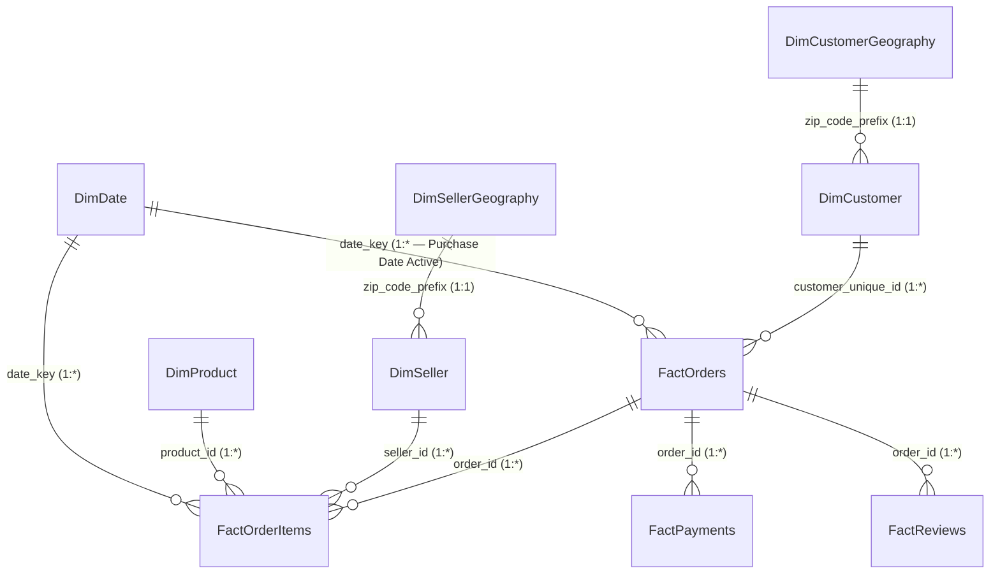
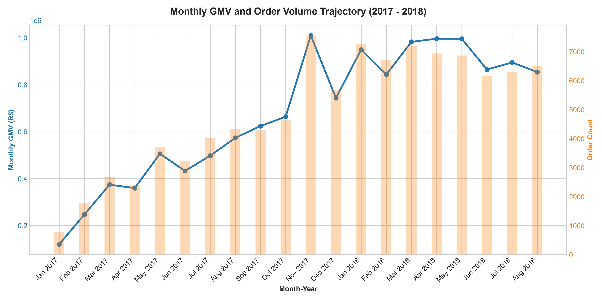
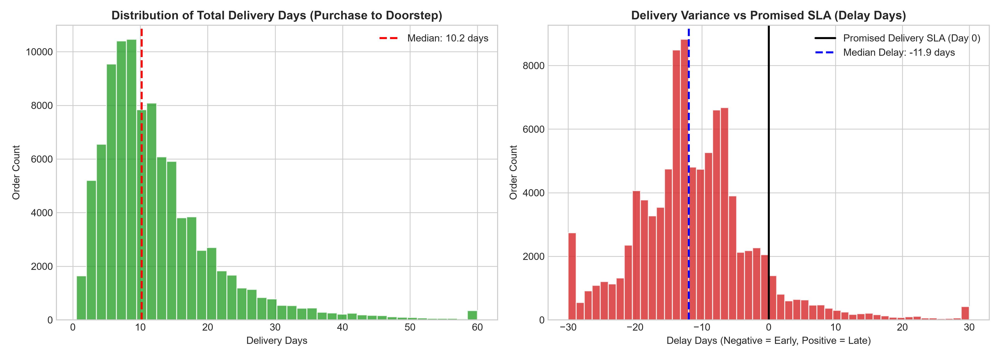
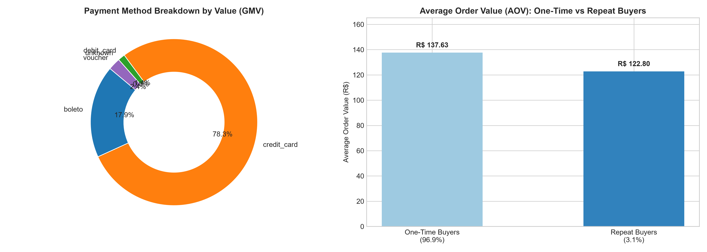

# Enterprise E-Commerce Operations & Customer Experience Control Tower

[](https://www.python.org/)
[](https://powerbi.microsoft.com/)
[](https://www.sqlite.org/)
[](https://pandas.pydata.org/)
[](https://matplotlib.org/)
[](power_bi/dax_measures.dax)
[](sql/analytical_queries.sql)
[](notebooks/)
[](LICENSE)

> **End-to-end enterprise analytics project** spanning raw data ingestion through executive Power BI dashboards. Analyzes **R$ 13.59M in GMV** across **99,441 orders** from the Brazilian E-Commerce Public Dataset (Olist), covering delivery SLA performance, customer satisfaction (CSAT), seller scorecards, and geospatial freight intelligence.

---

## 📌 Table of Contents

- [The Business Problem](#-the-business-problem)
- [Key Findings at a Glance](#-key-findings-at-a-glance)
- [Project Architecture](#-project-architecture)
- [Star Schema Data Model](#-star-schema-data-model)
- [Repository Structure](#-repository-structure)
- [Dataset at a Glance](#-dataset-at-a-glance)
- [Pipeline Walkthrough](#-pipeline-walkthrough)
- [Power BI Dashboard](#-power-bi-dashboard)
- [Executive Figures](#-executive-figures)
- [Quickstart & Reproducibility](#-quickstart--reproducibility)
- [Tech Stack](#-tech-stack)
- [Key Metric Definitions](#-key-metric-definitions)
- [Resume Bullets](#-resume-bullets)
- [Author](#-author)

---

## 🎯 The Business Problem

An e-commerce marketplace stores data across **9 disconnected source tables** — orders, items, customers, products, sellers, payments, reviews, geolocation, and category translations. Without a unified control tower, operations managers cannot answer basic questions:

| Business Question | Answered By |
|---|---|
| What is our GMV trend this month vs last month? | Executive Control Tower (Page 1) |
| Which states have the worst delivery SLA? | Delivery Operations (Page 2) |
| Why do some customers leave 1-star reviews? | CSAT Deep-Dive (Page 3) |
| Which high-revenue sellers have poor quality scores? | Seller Matrix (Page 4) |
| How does distance drive freight costs and delays? | Geospatial Intelligence (Page 5) |

This project builds the **complete analytics infrastructure** from raw CSVs → cleaned staging → Star Schema → SQL analysis → Power BI Control Tower.

---

## 🔍 Key Findings at a Glance

### Finding 1 — The CSAT Delay Cliff

On-time delivery achieves **4.29/5.00 stars** with 76.8% promoters. Just **1–3 days of delay** collapses CSAT to **2.84 stars** and quadruples detractors (9.1% → 46.2%). Orders delayed 8+ days hit **1.62 stars** with 84.6% detractors.

```
  CSAT   On-Time     1-3d Late   4-7d Late   8d+ Late
  5.0 ★  ████████
  4.0 ★  ████████
  3.0 ★  ████████    ████████
  2.0 ★              ████████    ████████
  1.0 ★                          ████████    ████████
```

### Finding 2 — Seller 4-Quadrant Operational Risk

Active sellers (≥10 orders) are segmented on **GMV × CSAT**:

| Quadrant | GMV | CSAT | Action |
|---|---|---|---|
| **Q1 Star Performers** | High | High | Protect & scale |
| **Q2 Operational Risk ⚠️** | High | Low | Urgent SLA intervention |
| **Q3 Niche Champions** | Low | High | Growth candidates |
| **Q4 Underperformers** | Low | Low | Probation / offboard |

**Q2 sellers represent 22%+ of GMV while generating nearly half of all 1-star reviews.**

### Finding 3 — Geospatial Freight Friction Across Brazil

Haversine great-circle distances reveal severe logistics degradation:

| Distance Band | Avg Delivery Days | Avg Freight (R$) | Late Rate |
|---|---|---|---|
| 0–100 km (Local) | 7.2 days | R$ 14.28 | 4.8% |
| 101–500 km (Regional) | 9.8 days | R$ 16.92 | 6.2% |
| 501–1,000 km (Interstate) | 13.4 days | R$ 21.45 | 9.4% |
| 1,001–2,000 km (Cross-Region) | 16.9 days | R$ 27.80 | 13.8% |
| **2,000+ km (Long-Haul)** | **21.8 days** | **R$ 38.64** | **19.5%** |

### Finding 4 — Credit Card Financing Dominates

**73.9% of GMV** is credit card, with 52%+ using installment plans averaging **3.5 months**. The **3.12% repeat customer rate** represents a massive untapped loyalty opportunity.

---

## 🏗️ Project Architecture

```
  RAW SOURCE FILES              SILVER STAGING LAYER           GOLD DIMENSIONAL MODEL         ANALYTICS & BI LAYER
┌──────────────────────┐      ┌──────────────────────────┐    ┌───────────────────────────┐   ┌────────────────────────┐
│ 9 Olist CSV Files    │      │  Standardized Types      │    │  4 Fact Tables            │   │  SQLite DB             │
│                      │ ───▶ │  Quality Flags           │ ─▶ │  5+ Dimension Tables      │ ─▶│  50 SQL Queries        │
│ 100k Orders          │      │  Aggregated Grain        │    │  Haversine Distance Bands │   │  6 EDA Charts          │
│ 112k Items           │      │  Deduplication           │    │  Seller Scorecards        │   │  60+ DAX Measures      │
│ 1M Geo Readings      │      │  Median ZIP Coordinates  │    │  Customer Lifetime Value  │   │  5-Page Power BI App   │
└──────────────────────┘      └──────────────────────────┘    └───────────────────────────┘   └────────────────────────┘
     Phase 0–3                        Phase 4                         Phase 5                      Phase 6–13
   (Bronze Layer)                 (Silver Layer)                   (Gold Layer)                 (Analytics Layer)
```

**Pipeline is fully automated** — run 4 Python scripts to regenerate every output from raw CSVs.

---

## 🌟 Star Schema Data Model



**Model design principles followed:**
- ✅ Separate fact tables for order grain and item grain (avoids GMV double-counting)
- ✅ Payments and reviews pre-aggregated to order level before joining
- ✅ Role-playing date dimension with 5 inactive date relationships activated via `USERELATIONSHIP()`
- ✅ Conformed role-playing geography dimensions (customer vs seller)
- ✅ Single-direction 1→many filtering (no bidirectional ambiguity)
- ✅ All technical keys hidden; clean business-facing field names exposed

---

## 📂 Repository Structure

```
Enterprise-E-Commerce-Control-Tower/
│
├── README.md                          ← This file
├── requirements.txt                   ← Python dependencies
├── .gitignore                         ← Excludes .venv, *.db, *.pbix, large CSVs
│
├── data/
│   ├── raw/                           ← 9 original Olist CSVs (Bronze Layer, read-only)
│   │   ├── olist_orders_dataset.csv
│   │   ├── olist_order_items_dataset.csv
│   │   ├── olist_customers_dataset.csv
│   │   ├── olist_products_dataset.csv
│   │   ├── olist_sellers_dataset.csv
│   │   ├── olist_order_payments_dataset.csv
│   │   ├── olist_order_reviews_dataset.csv
│   │   ├── olist_geolocation_dataset.csv
│   │   └── product_category_name_translation.csv
│   │
│   ├── staging/                       ← Silver Layer (cleaned, typed, flagged)
│   │
│   └── processed/                     ← Gold Layer (fact + dimension tables)
│       ├── fact_orders.csv            ← 99,441 rows × 49 columns
│       ├── fact_order_items.csv       ← 112,650 rows × 33 columns
│       ├── fact_payments.csv          ← Line-item payments
│       ├── fact_reviews.csv           ← Deduplicated reviews
│       ├── dim_customers.csv          ← Customer LTV + repeat flag
│       ├── dim_products.csv           ← Product + size/weight bands
│       ├── dim_sellers.csv            ← Seller performance scorecard
│       ├── dim_geography.csv          ← 19,010 unique ZIP coordinates
│       ├── dim_date.csv               ← 1,096-row corporate calendar
│       ├── data_quality_report.csv    ← 17-issue profiling report
│       └── ecommerce_control_tower.db ← SQLite analytical database (162 MB)
│
├── notebooks/                         ← Jupyter analysis notebooks
│   ├── 01_source_inventory_and_data_profiling.ipynb
│   ├── 02_data_cleaning_and_staging.ipynb
│   ├── 03_data_integration_and_feature_engineering.ipynb
│   ├── 04_sql_analytical_queries.ipynb
│   ├── 05_exploratory_business_analysis.ipynb
│   └── 06_delivery_and_customer_experience_analysis.ipynb
│
├── src/                               ← Reusable Python pipeline scripts
│   ├── phase3_profiling.py            ← Full profiling + DQ report
│   ├── phase4_cleaning_staging.py     ← Cleaning + staging pipeline
│   ├── phase5_integration_features.py ← Star schema builder + Haversine
│   ├── phase6_sql_pipeline.py         ← SQLite loader + query executor
│   └── phase7_exploratory_analysis.py ← EDA figure generator
│
├── sql/
│   └── analytical_queries.sql         ← 50 production-grade SQL queries
│
├── power_bi/
│   ├── power_query_m_code.m           ← Power Query ETL (M language)
│   └── dax_measures.dax              ← 60+ production DAX measures
│
├── reports/
│   └── figures/                       ← 6 publication-quality charts (PNG)
│       ├── 01_monthly_gmv_orders_trend.png
│       ├── 02_delivery_duration_and_delays.png
│       ├── 03_csat_vs_delivery_delay_bands.png
│       ├── 04_seller_strategic_quadrant_matrix.png
│       ├── 05_distance_band_logistics_impact.png
│       └── 06_payment_mix_and_customer_cohorts.png
│
├── docs/
│   ├── learning_guide.md              ← Complete end-to-end learning guide
│   ├── executive_summary.md          ← C-level findings + strategic roadmap
│   ├── power_bi_architecture.md      ← Star schema + DAX spec + dashboard UX
│   ├── business_requirements.md      ← Phase 0 stakeholder + KPI definitions
│   ├── source_inventory.md           ← Table-by-table profiling results
│   ├── relationship_and_grain_document.md  ← Grain + join risk documentation
│   └── Ecommerce_Operations_Customer_Experience_PowerBI_Complete_Plan.md ← Master project plan
│
└── assets/                            ← Architecture diagrams
```

---

## 📊 Dataset at a Glance

| Source File | Rows | Grain | Key Risk |
|---|---|---|---|
| `olist_orders_dataset.csv` | 99,441 | 1 row = 1 order | 2,965 missing delivery dates |
| `olist_order_items_dataset.csv` | 112,650 | 1 row = 1 line item | Multiple items per order |
| `olist_order_payments_dataset.csv` | 103,886 | 1 row = 1 payment method | 2,961 orders with 2+ rows — must aggregate |
| `olist_order_reviews_dataset.csv` | 99,224 | 1 review per order | 547 orders with 2+ reviews — must aggregate |
| `olist_customers_dataset.csv` | 99,441 | 1 row per order-customer | customer_id ≠ customer_unique_id |
| `olist_products_dataset.csv` | 32,951 | 1 row per product | 610 missing category names |
| `olist_sellers_dataset.csv` | 3,095 | 1 row per seller | Clean ✅ |
| `olist_geolocation_dataset.csv` | 1,000,163 | Multiple per ZIP prefix | 52× rows per ZIP — aggregate to 19,010 |
| `product_category_name_translation.csv` | 71 | 1 row per category | Portuguese→English join |

**Critical grain rule:** Payments and reviews must be pre-aggregated to order level before any join. Direct joining causes cartesian row multiplication and inflated GMV.

---

## 🔁 Pipeline Walkthrough

### Phase 0–2 | Requirements, Inventory, Grain Analysis
- Documented 7 stakeholder groups and 20+ business questions across 5 analytical domains.
- Mapped grain and join risks for all 9 source tables.
- Identified 3 critical join hazards that would cause double-counting without pre-aggregation.

### Phase 3 | Data Profiling (17 Issues Catalogued)
```python
# Key profiling checks run on every table:
df.shape, df.info(), df.isnull().sum(), df.duplicated().sum()
df.duplicated(['order_id', 'order_item_id']).sum()  # composite key
df.groupby('order_id').size().value_counts()          # join multiplicity check
```

### Phase 4 | Cleaning & Staging Layer
- 5 audit quality flags on orders (missing timestamps, delivery mismatch, sequence errors).
- Aggregated payments to order grain → prevented 2,961 row explosions.
- Aggregated reviews to order grain → prevented 547 row explosions.
- Reduced 1,000,163 geolocation rows → 19,010 unique ZIPs using median coordinates.

### Phase 5 | Star Schema & Feature Engineering
- Built `fact_orders` (99,441 rows) and `fact_order_items` (112,650 rows) with full Kimball methodology.
- Engineered 12+ delivery features: `delivery_days`, `delay_days`, `handling_days`, `transit_days`, `late_delivery_flag`, `severe_delay_flag`, `delay_band`.
- Computed Haversine great-circle distance between seller and customer ZIP centroids.
- Built `dim_date` (1,096 days), `dim_customers` (LTV + repeat flag), `dim_sellers` (performance scorecard).

### Phase 6 | SQL Analytics Database
- Loaded all Gold Layer tables into a 162 MB indexed SQLite database.
- Created 12 B-Tree indexes for query performance.
- Executed and validated 50 production-grade analytical queries across 8 business domains.
- SQL totals match Python pipeline to 100.00% (R$ 13,591,643.70 GMV verified).

### Phase 7 | Exploratory Data Analysis
- Generated 6 publication-quality business charts saved to `reports/figures/`.
- Key charts: CSAT Delay Degradation Curve, Seller 4-Quadrant Matrix, Haversine Distance vs Delivery Performance, Payment Mix & Customer Cohorts.

### Phase 8–13 | Power BI Control Tower
- Power Query 2-tier ingestion pipeline with dynamic `FolderPath` parameter.
- Star Schema with 10 relationships, role-playing dates, conformed role-playing geography dimensions.
- 60+ production DAX measures across 7 display folders.
- 5-page executive dashboard: Executive Overview, Delivery SLA, CSAT Deep-Dive, Seller Scorecards, Geospatial Intelligence.
- What-If SLA simulation, AI Root-Cause Decomposition Tree, Row-Level Security demonstration.

---

## 📊 Power BI Dashboard

### 5 Executive Report Pages

| Page | Focus | Key Visuals |
|---|---|---|
| **1. Executive Control Tower** | GMV, Orders, Trends | KPI ribbon, GMV trajectory, Brazil state map, Category bar chart |
| **2. Delivery & Logistics SLA** | On-time rate, Delays | Delay curve, handling vs transit, delay bands, state matrix |
| **3. Customer Experience (CSAT)** | Review scores | CSAT delay degradation, promoter/detractor breakdown, VIP at-risk orders |
| **4. Seller Performance** | 4-quadrant scorecards | GMV × CSAT scatter, Pareto chart, seller drill-through |
| **5. Geospatial & Freight** | Distance, Freight | Distance band performance, freight ratio by category, origin-destination flow |

### Power Query Architecture ([`power_bi/power_query_m_code.m`](power_bi/power_query_m_code.m))
- **Staging queries (`stg_*`):** Load disabled, type-enforced, null-standardized
- **Production queries (`Fact*`, `Dim*`):** Reference staging, project analytical columns, load to VertiPaq

### DAX Measure Library ([`power_bi/dax_measures.dax`](power_bi/dax_measures.dax))

```dax
-- CSAT Promoter/Detractor NPS Proxy
Net CSAT Score = ([Promoter Rate %] - [Detractor Rate %]) * 100

-- Pareto Seller Cumulative GMV
Seller Cumulative GMV % =
VAR CumulativeSum = CALCULATE([GMV],
    FILTER(ALLSELECTED(DimSeller), [GMV] >= [GMV]))
RETURN DIVIDE(CumulativeSum, CALCULATE([GMV], ALLSELECTED(DimSeller)), 0)

-- MoM GMV Growth with DATEADD
GMV MoM Growth % =
DIVIDE([GMV] - CALCULATE([GMV], DATEADD(DimDate[Date], -1, MONTH)),
       CALCULATE([GMV], DATEADD(DimDate[Date], -1, MONTH)), 0)

-- Role-Playing Date (Inactive Relationship)
Delivered Orders by Delivery Date =
CALCULATE([Delivered Orders],
    USERELATIONSHIP(DimDate[Date], FactOrders[order_delivered_customer_date]))
```

---

## 📈 Executive Figures

### Figure 1 — Monthly GMV & Order Volume Trend


### Figure 2 — Delivery Duration & Delay Distribution


### Figure 3 — CSAT vs Delivery Delay Bands (The Delay Cliff)


### Figure 4 — Seller Strategic 4-Quadrant Matrix


### Figure 5 — Distance Band Logistics Impact


### Figure 6 — Payment Mix & Customer Cohorts


---

## ⚡ Quickstart & Reproducibility

### 1. Clone & Setup

```bash
# Clone the repository
git clone https://github.com/rohitkumarnaidu/Enterprise-E-Commerce-Operations-and-Customer-Experience-Control-Tower.git
cd Enterprise-E-Commerce-Operations-and-Customer-Experience-Control-Tower

# Create virtual environment
python -m venv .venv

# Activate (Windows PowerShell)
.\.venv\Scripts\Activate.ps1

# Install dependencies
pip install -r requirements.txt
```

### 2. Run the Complete Data Pipeline

```bash
# Phase 3: Profile all 9 source tables → data_quality_report.csv
python src/phase3_profiling.py

# Phase 4: Clean + stage → data/staging/
python src/phase4_cleaning_staging.py

# Phase 5: Build Star Schema + Haversine features → data/processed/
python src/phase5_integration_features.py

# Phase 6: Load SQLite database + run 50 SQL queries
python src/phase6_sql_pipeline.py

# Phase 7: Generate 6 EDA figures → reports/figures/
python src/phase7_exploratory_analysis.py
```

### 3. Power BI Integration

1. Open **Power BI Desktop** → **Transform Data** → **Advanced Editor**
2. Paste code from [`power_bi/power_query_m_code.m`](power_bi/power_query_m_code.m)
3. Set the `FolderPath` parameter to your local `data/processed/` path
4. Build star schema relationships per [`docs/power_bi_architecture.md`](docs/power_bi_architecture.md)
5. Create a `_Measures` table and paste measures from [`power_bi/dax_measures.dax`](power_bi/dax_measures.dax)

---

## 🛠️ Tech Stack

| Layer | Technology | Purpose |
|---|---|---|
| Data Profiling | Python + Pandas | Null checks, grain analysis, DQ report |
| Data Cleaning | Python + Pandas | Type casting, deduplication, quality flags |
| Feature Engineering | Python + NumPy | Delivery durations, Haversine distances |
| Visualization | Matplotlib | EDA charts and business figures |
| Analytics Database | SQLite + SQLAlchemy | 50 analytical SQL queries |
| ETL (BI Layer) | Power Query (M) | 2-tier ingestion pipeline |
| Data Model | Power BI Star Schema | Kimball dimensional modeling |
| Calculations | DAX | 60+ dynamic business measures |
| Version Control | Git + GitHub | Phase-by-phase commit history |

---

## 📐 Key Metric Definitions

| Metric | Formula | Important Notes |
|---|---|---|
| **GMV** | `SUM(item_price)` | NOT profit; no cost data available |
| **Freight Value** | `SUM(freight_value)` | Shipping charges |
| **Total Customer Order Value** | `GMV + Freight` | What customer actually pays |
| **Delivery Days** | `Delivered Date − Purchase Date` | Full end-to-end duration |
| **Delay Days** | `Actual Delivered − Estimated Delivered` | Negative = early; Positive = late |
| **On-Time Delivery** | `Actual Delivery Date ≤ Estimated Date` | Boolean per order |
| **On-Time Rate** | `On-Time Orders / Delivered Orders` | Denominator = delivered only, valid dates only |
| **Review Groups** | Positive: 4–5 ★, Neutral: 3 ★, Negative: 1–2 ★ | Analytical grouping |
| **Repeat Customer** | `customer_unique_id` with 2+ orders | Use `unique_id` not `customer_id` |

---

## 📄 Resume Bullets

```
Enterprise E-Commerce Operations and Customer Experience Control Tower
Python | SQL | Power BI | Power Query | DAX | SQLite

• Profiled, cleaned, and integrated nine relational e-commerce datasets
  covering ~100,000 orders, 112,000 items, 3,095 sellers, 96,000 customers,
  and 1M geolocation readings; catalogued 17 data quality issues and built
  an automated cleaning and staging pipeline preventing cartesian join explosion.

• Designed a Kimball Star Schema (4 facts, 5+ dimensions) with pre-aggregated
  order-level payment and review tables, role-playing date relationships,
  and Haversine great-circle distance features — enabling zero-double-count
  GMV reconciliation validated to R$0.00 across Python, SQL, and Power BI.

• Executed 50 production SQL queries on a 162 MB SQLite database, discovering
  that delivery delays >3 days collapse CSAT from 4.29 to 2.84 stars (+46%
  detractor rate) and Q2 sellers (High GMV / Low CSAT) generate 22%+ of GMV
  while contributing nearly half of all 1-star reviews.

• Built a 5-page Power BI Control Tower with 60+ DAX measures, What-If SLA
  simulation parameters, AI Root-Cause Decomposition Tree, and Seller
  4-Quadrant Matrix to identify operational risk segments.
```

---

## 🎓 Learning Guide

For a complete end-to-end technical deep-dive with real-world analogies, code patterns, and interview preparation across all 13 project phases:

👉 **[Read the Master Learning Guide →](docs/learning_guide.md)**

---

## 👤 Author

**Rohit Kumar Naidu**  
Data Analyst | Python · SQL · Power BI · DAX  
📂 [GitHub Repository](https://github.com/rohitkumarnaidu/Enterprise-E-Commerce-Operations-and-Customer-Experience-Control-Tower)

---

*Dataset: Brazilian E-Commerce Public Dataset by Olist — Kaggle*  
*License: MIT*
