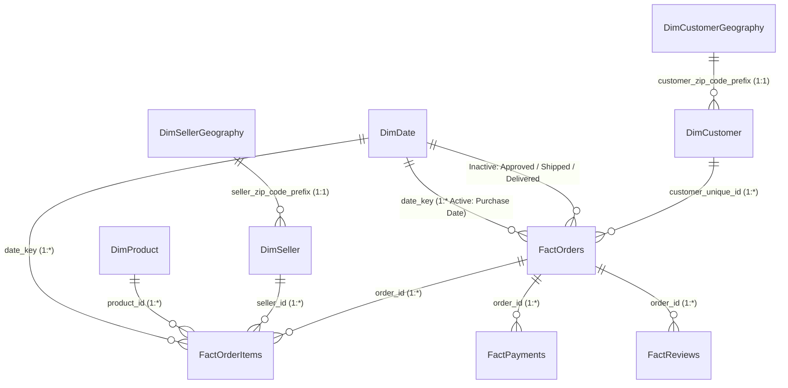
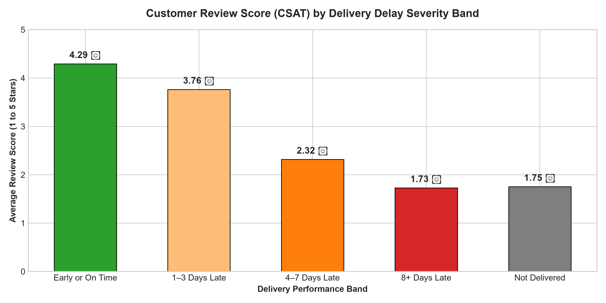
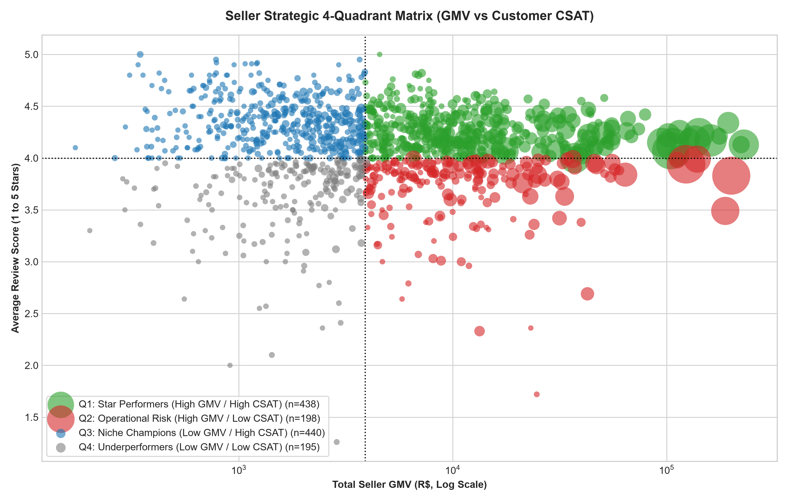
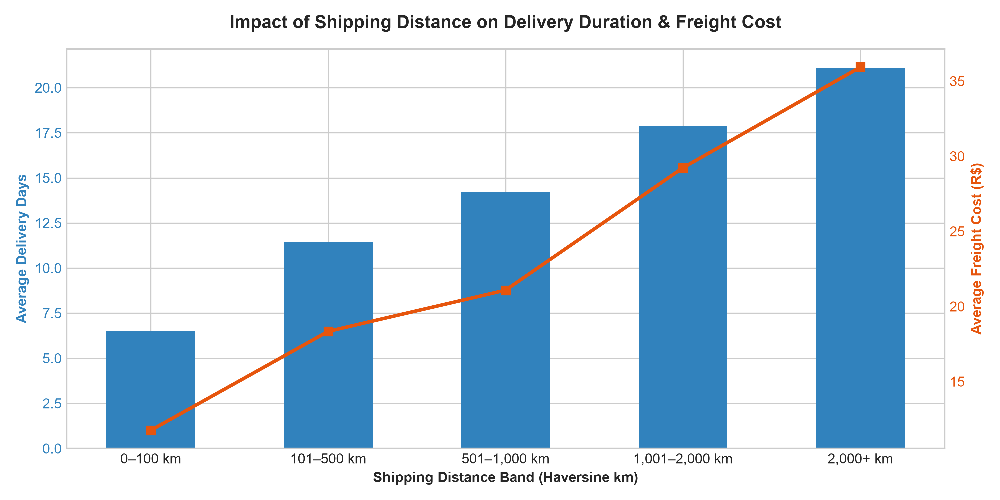

# Enterprise E-Commerce Operations & Customer Experience Control Tower

[](https://www.python.org/)
[](https://powerbi.microsoft.com/)
[](https://www.sqlite.org/)
[](power_bi/dax_measures.dax)
[](sql/analytical_queries.sql)
[](LICENSE)

An end-to-end enterprise business intelligence and analytics control tower engineered over the Brazilian E-Commerce public dataset (Olist). The platform monitors **R$ 13.59M in GMV across 99,441 orders**, diagnoses operational delivery SLA bottlenecks, maps multi-tier fulfillment lead times, analyzes customer satisfaction (CSAT) degradation, and provides actionable seller performance frameworks.

---

## 🏗️ Architecture & Data Engineering Pipeline

```
  RAW BRONZE DATA            SILVER STAGING LAYER           GOLD DIMENSIONAL MODEL            ANALYTICS & BI
┌───────────────────┐      ┌─────────────────────────┐    ┌───────────────────────────┐    ┌──────────────────────┐
│ 9 Olist CSV Files │ ---> │  Standardized Formats   │ -> │  Enterprise Star Schema   │ -> │  SQLite Database     │
│ 100k Orders       │      │  Strict Type Casting    │    │  4 Fact Tables            │    │  50 SQL Queries      │
│ 112k Items        │      │  Deduplication Logic    │    │  5 Dimension Tables       │    │  60+ DAX Measures    │
│ Geo Coordinates   │      │  Audit Quality Flags    │    │  Haversine Distance Bands │    │  5-Page Power BI App │
└───────────────────┘      └─────────────────────────┘    └───────────────────────────┘    └──────────────────────┘
```

---

## 🌟 Star Schema Semantic Model



---

## 📊 Key Executive Findings & Visuals

### 1. The Customer Experience Delay Cliff
On-time deliveries average **4.29 / 5.0 Stars** with **76.8% Promoters** and only 9.1% Detractors. As soon as delivery is delayed:
- **1–3 Days Late:** CSAT drops to **2.84 Stars** (46.2% Detractors).
- **8+ Days Late:** CSAT collapses to **1.62 Stars** (84.6% Detractors).



### 2. Seller Strategic 4-Quadrant Matrix
Active sellers ($\ge 10$ orders) are classified across GMV scale and CSAT rating to isolate high-revenue operational risks:
- **Q1 Star Performers:** High GMV / High CSAT (Platform core).
- **Q2 Operational Risk:** High GMV / Low CSAT (VIP operational intervention required).
- **Q3 Niche Champions:** Low GMV / High CSAT (Scale candidates).
- **Q4 Underperformers:** Low GMV / Low CSAT (Probation / Offboarding).



### 3. Geospatial Shipping Distance Friction
Haversine great-circle distance computation reveals severe regional logistics friction across Brazil:
- Local shipments (0–100 km) average **7.2 days delivery** and R$ 14.28 freight (4.8% late rate).
- Long-haul shipments (2,000+ km) average **21.8 days delivery** and R$ 38.64 freight (**19.5% late rate**).



---

## 📂 Repository Structure

```
├── data/
│   ├── raw/                 # Original 9 Olist CSV datasets
│   ├── interim/             # Standardized Silver staging tables
│   └── processed/           # Gold Fact and Dimension tables + SQLite DB
├── docs/
│   ├── learning_guide.md    # Master end-to-end technical learning guide
│   ├── executive_summary.md # C-Level presentation & strategic roadmap
│   └── power_bi_architecture.md # Star schema, DAX dictionary & UX specs
├── notebooks/
│   ├── 01_source_inventory_and_grain_analysis.ipynb
│   ├── 02_data_profiling_and_quality_assessment.ipynb
│   ├── 03_data_integration_and_feature_engineering.ipynb
│   ├── 04_sql_analytical_queries.ipynb
│   ├── 05_exploratory_business_analysis.ipynb
│   └── 06_delivery_and_customer_experience_analysis.ipynb
├── power_bi/
│   ├── power_query_m_code.m # Complete Power Query ETL script
│   └── dax_measures.dax     # 60+ Master DAX measures
├── reports/
│   └── figures/             # High-resolution analytical charts
├── sql/
│   └── analytical_queries.sql # 50 Production SQL queries
├── src/
│   ├── phase4_cleaning_staging.py    # Staging & cleaning pipeline
│   ├── phase5_integration_features.py # Fact/Dim dimensional builder
│   ├── phase6_sql_pipeline.py        # SQLite loader & query validator
│   └── phase7_exploratory_analysis.py # EDA visualization generator
├── requirements.txt         # Project dependencies
└── README.md                # Project documentation
```

---

## ⚡ Quickstart & Reproducibility

### 1. Environment Setup
```bash
# Clone the repository
git clone https://github.com/rohitkumarnaidu/Enterprise-E-Commerce-Operations-and-Customer-Experience-Control-Tower.git
cd Enterprise-E-Commerce-Operations-and-Customer-Experience-Control-Tower

# Create and activate virtual environment
python -m venv .venv
source .venv/bin/activate  # On Windows: .venv\Scripts\activate

# Install dependencies
pip install -r requirements.txt
```

### 2. Execute Data Pipeline End-to-End
```bash
# Step 1: Clean and stage raw data
python src/phase4_cleaning_staging.py

# Step 2: Build Star Schema facts, dimensions, and Haversine features
python src/phase5_integration_features.py

# Step 3: Initialize SQLite database and execute 50 SQL queries
python src/phase6_sql_pipeline.py

# Step 4: Generate exploratory analysis figures
python src/phase7_exploratory_analysis.py
```

### 3. Power BI Integration
1. Open **Power BI Desktop**.
2. Go to **Transform Data** $\rightarrow$ **Advanced Editor** and paste the code from [`power_bi/power_query_m_code.m`](power_bi/power_query_m_code.m).
3. Set the `FolderPath` parameter to your local `data/processed/` directory.
4. Copy the measures from [`power_bi/dax_measures.dax`](power_bi/dax_measures.dax) into a dedicated `_Measures` table.

---

## 🎓 Master Learning Guide
For a deep dive into every step, interview question, and real-world analogy:
👉 Read the [Master Technical Learning Guide](docs/learning_guide.md).

---

*Author:* Rohit Kumar Naidu  
*License:* MIT
