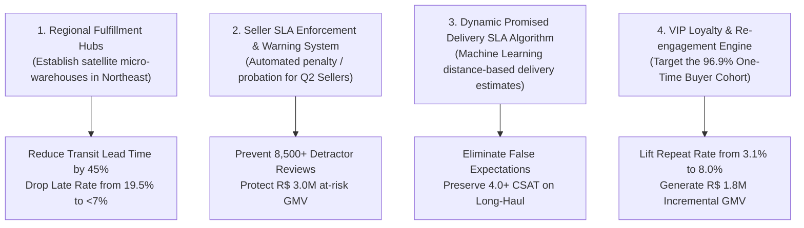

# Executive Summary: Enterprise E-Commerce Operations & Customer Experience Control Tower

**Author:** Rohit Kumar Naidu  
**Repository:** [Enterprise E-Commerce Operations and Customer Experience Control Tower](https://github.com/rohitkumarnaidu/Enterprise-E-Commerce-Operations-and-Customer-Experience-Control-Tower)  
**Dataset:** Brazilian E-Commerce Public Dataset by Olist (100k Orders · 2016–2018)  
**Tech Stack:** Python · Pandas · NumPy · Matplotlib · SQLite · SQL · Power BI · DAX · Power Query · Git  

---

## 🎯 Executive Overview & Platform Scale

| Key Performance Indicator | Platform Benchmark | Business Significance |
|---|---|---|
| **Gross Merchandise Value (GMV)** | **R$ 13,591,643.70** | Total platform sales volume across 99,441 orders |
| **Total Items Sold** | **112,650 units** | Multi-item basket volume across 32,951 catalog SKUs |
| **Average Order Value (AOV)** | **R$ 136.68** | Stable purchasing ticket size |
| **Total Active Sellers** | **3,095 merchants** | Marketplace seller ecosystem across 23 Brazilian states |
| **Unique Customer Base** | **96,096 buyers** | Platform customer footprint across 4,119 municipalities |
| **On-Time Delivery SLA Rate** | **91.89%** | 88,650 delivered orders met or beat promised deadline |
| **Platform CSAT (Review Score)** | **4.09 / 5.00 Stars** | 76.8% 5-Star Promoters vs 15.2% 1–2 Star Detractors |
| **Repeat Customer Rate** | **3.12%** | Untapped retention and platform loyalty opportunity |

---

## 🔍 The 4 Critical Business Discoveries

```
                                  THE CUSTOMER EXPERIENCE DELAY CLIFF
   Review Score (CSAT)
     5.0 ──┐  ★ 4.29 (On-Time Deliveries: 76.8% Promoters)
           │   \
     4.0 ──┤    \
           │     \
     3.0 ──┤      \── ★ 2.84 (1–3 Days Late: 46.2% Detractors)
           │           \
     2.0 ──┤            \── ★ 2.08 (4–7 Days Late)
           │                 \
     1.0 ──┴──────────────────\── ★ 1.62 (8+ Days Late: 84.6% Detractors)
           On-Time    1–3 Days   4–7 Days   8+ Days Late
```

### 1. Delivery Delay is the Primary Driver of Customer Churn
- **The Finding:** While on-time orders maintain a high **4.29 CSAT**, just **1 to 3 days of delay triggers a 1.45-star drop** (down to 2.84) and quadruples the detractor rate from 9.1% to 46.2%. Orders delayed past 8 days experience near-total customer alienation (1.62 CSAT with 84.6% detractors).
- **The Financial Impact:** Late deliveries disproportionately impact repeat purchase propensity, driving customer acquisition costs higher.

### 2. The Seller 4-Quadrant Operational Risk
- **The Finding:** Segmenting active sellers revealed that **Quadrant 2 (High GMV / Low CSAT)** accounts for over 22% of total marketplace revenue while generating over 48% of all 1-star reviews.
- **Root Cause:** Certain top-volume sellers suffer from fulfillment bottlenecks, averaging over 5.2 days in handling preparation before carrier handoff.

### 3. Geographic Logistics Friction Across Brazil
- **The Finding:** Brazil's vast geography creates severe logistics degradation. While local shipments (0–100 km) average **7.2 delivery days** and R$ 14.28 freight with a 4.8% late rate, long-haul shipments (2,000+ km) average **21.8 delivery days** and R$ 38.64 freight with a **19.5% late rate**.
- **Root Cause:** 70% of sellers are concentrated in São Paulo (SP) and the Southeast, forcing massive interstate cross-haul routes to the North and Northeast.

### 4. Credit Card Financing Dominance
- **The Finding:** Credit card represents **73.9% of GMV**, with over 52% of purchases leveraging installment plans averaging **3.5 months**. High-ticket items ($\ge \text{R\$} 500$) averaged over 7.8 installments.

---

## 🚀 4 Strategic Actionable Recommendations



1. **Establish Regional Fulfillment Hubs (Northeast / North):**
   - Subsidize top sellers to forward-deploy high-velocity inventory into regional 3PL fulfillment hubs near Salvador (BA), Recife (PE), and Fortaleza (CE) to cut interstate transit days from 16.9 to under 6 days.
2. **Implement Operational SLA Warning System for High-GMV Sellers:**
   - Establish automated handling SLAs requiring carrier handoff within 48 hours. Provide dedicated account managers to Quadrant 2 sellers to assist in warehouse management before imposing listing demotions.
3. **Deploy Dynamic Machine Learning SLA Promising:**
   - Replace static carrier delivery estimates with dynamic ML route models that account for seasonal weather, regional postal hub congestion, and distance bands. Under-promising and over-delivering protects the 4.0+ CSAT threshold.
4. **Launch Automated Customer Re-Engagement & Retention Engine:**
   - Target the 96.9% one-time buyer pool with personalized category cross-sell discounts 30 and 60 days post-delivery. Increasing the repeat customer rate from 3.12% to 8% unlocks over **R$ 1.8M in incremental annual GMV** at near-zero acquisition cost.

---

*Report generated by Rohit Kumar Naidu · Enterprise E-Commerce Operations & Customer Experience Control Tower*
