# 📚 End-to-End Data Analytics Project — Complete Learning Guide

> **This document grows with the project.** Every phase we complete, this file gets updated with what we did, why we did it, how it works, where it is used in the real world, and how to explain it in an interview.

---

## 🗺️ Table of Contents

| # | Section |
|---|---|
| 1 | [What Is This Project?](#-1-what-is-this-project) |
| 2 | [The Big Picture Architecture](#-2-the-big-picture-architecture) |
| 3 | [Tools and Why We Use Them](#-3-tools-and-why-we-use-them) |
| 4 | [Phase 0 — Business Requirements](#-phase-0--business-requirements) |
| 5 | [Phase 1 — Environment Setup](#-phase-1--environment-setup) |
| 6 | [Phase 2 — Source Inventory and Grain Analysis](#-phase-2--source-inventory-and-grain-analysis) |
| 7 | [Phase 3 — Data Profiling](#-phase-3--data-profiling) |
| 8 | [Phase 4 — Data Cleaning and Staging Layer](#-phase-4--data-cleaning-and-staging-layer) |
| 9 | [Phase 5 — Data Integration & Feature Engineering](#-phase-5--data-integration--feature-engineering) |
| 10 | [Key Concepts Glossary](#-key-concepts-glossary) |
| 11 | [Real-World Analogies](#-real-world-analogies) |
| 12 | [Interview Cheat Sheet](#-interview-cheat-sheet) |

---

## 🎯 1. What Is This Project?

### What?
We are building an **Enterprise E-Commerce Operations and Customer Experience Control Tower** using the **Brazilian E-Commerce Public Dataset by Olist** with 9 interconnected tables covering ~100,000 real orders from 2016–2018.

This is **NOT** a simple sales dashboard. It is a full operational intelligence system that answers five fundamental business questions:

```
1. What is happening?          → Executive KPIs, GMV, order status
2. Where is the problem?       → Geography, seller, category breakdown
3. Why might it be happening?  → Decomposition Tree, Key Influencers
4. Who is affected?            → Sellers, customers, categories, states
5. What action to take?        → Recommendations, What-If scenarios
```

### Why Does This Project Matter?

In the real world, e-commerce companies like **Flipkart, Amazon, Meesho, and Nykaa** have data flowing from multiple disconnected systems simultaneously:

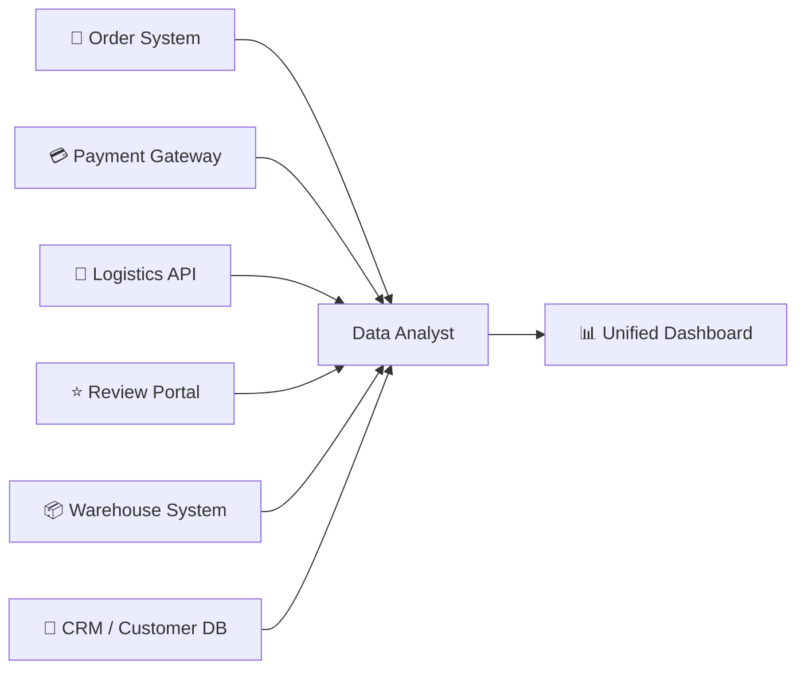

A data analyst's job is to connect all of these scattered systems and tell one clear, accurate story. This project simulates exactly that.

### Who Uses the Final Dashboard?

| 👤 Stakeholder | 🎯 What They Need |
|---|---|
| E-commerce Operations Manager | Order volumes, delivery SLA, cancellations |
| Logistics Manager | On-time rate, delay hotspots by state |
| Seller Management Team | Seller scorecard — GMV, delivery, reviews |
| Customer Experience Team | Review scores, negative review drivers |
| Category Manager | Category GMV, freight ratio, satisfaction |
| Executive Management | Monthly GMV trend, overall KPI summary |

### Where Is This Used in the Real World?

| 🏢 Company | 🔍 Use Case |
|---|---|
| Flipkart / Amazon India | Operations dashboards tracking lakh-scale daily shipments |
| Swiggy / Zomato | Delivery SLA monitoring — which restaurants cause delays |
| Meesho | Seller quality scorecard rating 1 lakh+ sellers |
| Nykaa / Myntra | Category performance by GMV and return rate |
| Any D2C Brand | Shopify + logistics API → Power BI to see daily order health |

---

## 🏗️ 2. The Big Picture Architecture

### End-to-End Flow

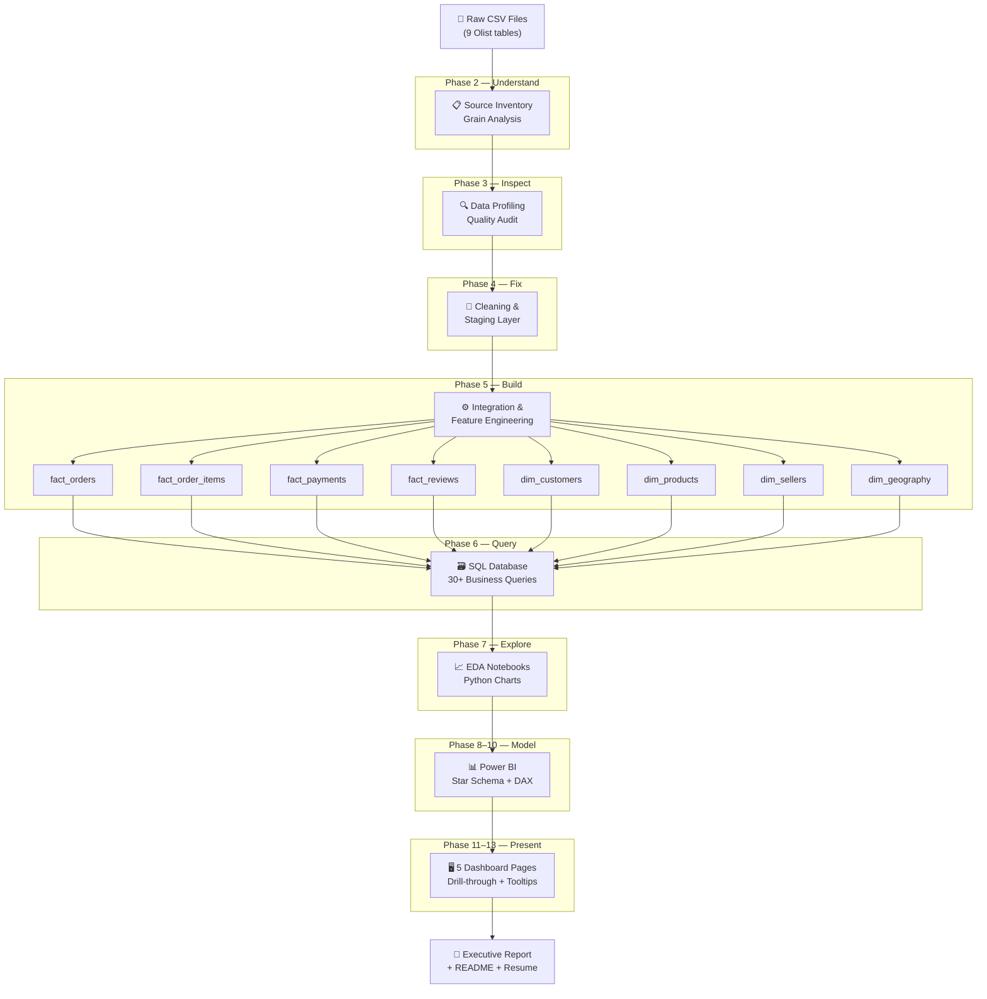

### Why This Specific Order?

> You cannot clean data before understanding it.
> You cannot model data before cleaning it.
> You cannot write DAX before modeling.

Each phase **depends on the one before it.** This is how professional data pipelines are built.

---

## 🛠️ 3. Tools and Why We Use Them

### Technology Stack at a Glance

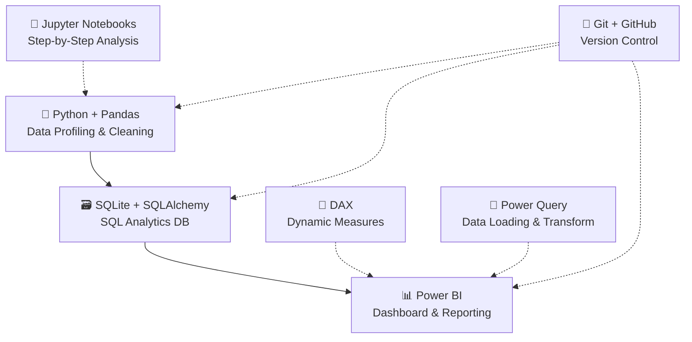

---

### 🐍 Python + Pandas

**What is it?**
Python is a programming language. Pandas is its most powerful library for working with tabular data — like Excel but 100× more powerful.

**Why we use it:**
- Handles millions of rows without crashing (Excel breaks at ~1M rows)
- Automates checks across all 9 files in seconds
- Joins, transforms, and engineers features from multiple tables

**Where it is used in real companies:**

| Company | How They Use Python |
|---|---|
| Walmart | Clean 50M+ product records for their catalog |
| Zomato | Join order, delivery, and restaurant tables |
| Paytm | Fraud detection on payment transaction data |
| Google | Every internal analytics pipeline |

**Key commands:**

```python
df.shape           # How many rows and columns?
df.info()          # What are the data types?
df.isnull().sum()  # How many missing values per column?
df.duplicated()    # Any duplicate rows?
df.describe()      # Min, max, mean, std statistics
df.groupby()       # Aggregate — like SQL GROUP BY
pd.merge()         # Join two tables — like SQL JOIN
```

---

### 🗃️ SQL + SQLite

**What is it?**
SQL (Structured Query Language) is the universal language for querying relational databases.
SQLite is a lightweight database engine — the entire database is one `.db` file.

**Why SQL is non-negotiable:**

```
90% of data analyst job descriptions mention SQL as a required skill.
SQL is used on every database platform — MySQL, PostgreSQL, BigQuery, Snowflake.
```

**Key SQL concepts we will use:**

```sql
-- Basic query
SELECT order_id, order_status, order_purchase_timestamp
FROM fact_orders
WHERE order_status = 'delivered';

-- Aggregation (GROUP BY)
SELECT seller_state, COUNT(*) AS total_orders, SUM(gmv) AS total_gmv
FROM fact_orders
GROUP BY seller_state
ORDER BY total_gmv DESC;

-- Window Function (RANK)
SELECT seller_id, gmv,
       RANK() OVER (ORDER BY gmv DESC) AS gmv_rank
FROM seller_scorecard;

-- CTE (reusable subquery)
WITH on_time AS (
    SELECT order_id
    FROM fact_orders
    WHERE delivered_date <= estimated_date
)
SELECT COUNT(*) FROM on_time;
```

**Real-world usage:**

| Analyst Role | SQL Platform |
|---|---|
| Flipkart Data Analyst | Google BigQuery |
| Bank Risk Analyst | Oracle / SQL Server |
| Startup Analyst | PostgreSQL / MySQL |
| Data Scientist | Snowflake / Redshift |

---

### 📊 Power BI

**What is it?**
Microsoft Power BI is the industry-standard business intelligence tool used to build interactive dashboards for non-technical stakeholders.

**5 Power BI features we will build:**

| Feature | What It Does |
|---|---|
| Decomposition Tree | Visually breaks down a metric by multiple dimensions to find root causes |
| Key Influencers | Shows which factors most influence a target metric (e.g., low review score) |
| What-If Parameter | Lets the user simulate "what if on-time rate improves to 95%?" |
| Drill-through | Right-click a seller → see a detailed seller-specific page |
| Report-page Tooltips | Hover over a bar → see a mini-dashboard popup |

**Where it is used:**

| Company Type | Use Case |
|---|---|
| Reliance Retail | Store-level sales monitoring across India |
| TCS / Infosys | Client delivery SLA dashboards |
| HDFC Bank | Loan portfolio performance tracking |
| Any enterprise | Monthly executive KPI reporting |

---

### 🧮 DAX (Data Analysis Expressions)

**What is it?**
DAX is Power BI's formula language for creating dynamic calculated metrics.

**Why not just hardcode the numbers?**

Because filters change everything. When a manager filters to "SP (São Paulo) sellers only" + "Q1 2018," every single KPI must recalculate automatically. DAX does this instantly.

**Example DAX measures we will write:**

```dax
// Total GMV
GMV = SUM(FactOrderItems[Price])

// On-Time Delivery Rate
On-Time Delivery Rate =
DIVIDE(
    CALCULATE([Delivered Orders], FactOrders[LateDeliveryFlag] = 0),
    [Delivered Orders],
    0
)

// Month-over-Month GMV Growth
MoM GMV Growth % =
DIVIDE(
    [GMV] - [Previous Month GMV],
    [Previous Month GMV],
    0
)
```

---

### 🔗 Git + GitHub

**What is it?**
Git tracks every change you make to your project files — like "track changes" in Word but for code. GitHub hosts the project online for the world (and recruiters) to see.

**How commits tell your project story:**

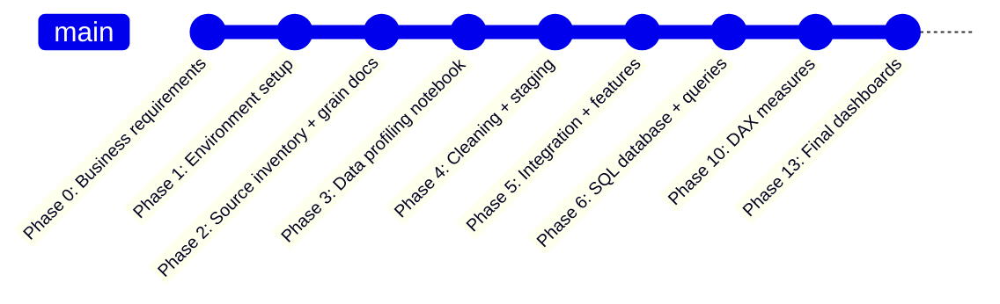

Each commit proves you built it step by step — not a copy-paste job.

---

## 📋 Phase 0 — Business Requirements

**File created:** [`docs/business_requirements.md`](./business_requirements.md)

### What Did We Do?
Created a document that defines what this project must deliver **before writing a single line of code.**

### Why Does This Phase Matter?

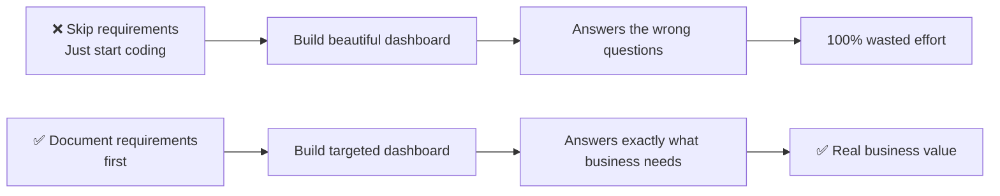

### What Is in Our Business Requirements?

**1. Stakeholders** — 7 types of people who use this dashboard

**2. Business Questions (20+)** grouped by domain:

```
Executive  → How many orders? What is GMV? What is the trend?
Delivery   → What is the on-time rate? Which states have high delays?
CX         → What is the average review score? What drives low scores?
Seller     → Which sellers have high GMV but poor delivery?
Payments   → Which payment types dominate? What is avg installments?
```

**3. Metric Definitions** — Exact formulas agreed upfront:

| Metric | Formula |
|---|---|
| GMV | `SUM(item_price)` |
| Freight Value | `SUM(freight_value)` |
| Total Customer Order Value | `GMV + Freight Value` |
| Delivery Time | `Delivered Date − Purchase Date` |
| Delay Days | `Actual Delivery − Estimated Delivery` |
| On-Time Delivery | `Actual Date <= Estimated Date` |
| Review Groups | Positive (4–5), Neutral (3), Negative (1–2) |

**4. Out of Scope:**
- Profit (no cost data in the dataset)
- Real-time tracking (static historical dataset)
- Exact carrier analysis (no carrier ID in data)
- Causal claims (correlation ≠ causation)

### Real-World Analogy
Ordering food at a restaurant. The business requirements document is the **order you place before the kitchen starts cooking**. Without a clear order, the kitchen (data team) guesses — and you get the wrong food.

---

## ⚙️ Phase 1 — Environment Setup

### What Did We Do?


### Why a Virtual Environment?

**The Problem Without It:**

```
Your System Python
├── Project A needs pandas 1.5  ← conflicts!
└── Project B needs pandas 2.0  ← conflicts!
= Both projects break
```

**The Solution With It:**

```
.venv (this project only)
└── pandas 3.0, numpy 2.5, matplotlib 3.11... (exact versions, isolated)

Other Project/.venv
└── completely separate packages, no conflict
```

**Real-world analogy:** A separate toolbox for each construction project. No mixing. No breaking each other's tools.

### Why `.gitignore`?

| Ignored Item | Reason |
|---|---|
| `.venv/` | 200MB+ folder — recreatable from `requirements.txt` |
| `*.csv` | Geolocation CSV alone is 61MB — GitHub limit is 100MB |
| `*.db` | SQLite database files |
| `*.pbix` | Power BI binary files |
| `__pycache__/` | Python auto-generated temp files |

> **Golden Rule:** Never push sensitive data (emails, passwords, API keys) or massive binary files to GitHub.

### Folder Structure and Why

```
ecommerce-control-tower/
├── 📁 data/
│   ├── raw/       ← SACRED: original files, never modified
│   ├── staging/   ← cleaned versions of raw
│   └── processed/ ← final fact + dimension tables
├── 📓 notebooks/  ← Jupyter analysis (one per phase)
├── 🐍 src/        ← reusable Python helper scripts
├── 🗃️ sql/        ← 30+ business queries
├── 🗄️ database/   ← SQLite .db file
├── 📊 powerbi/    ← .pbix + screenshots
├── 📄 reports/    ← executive insights report
├── 📚 docs/       ← all documentation
└── 🖼️ assets/     ← diagrams and images
```

**Why separate `raw` from `staging` from `processed`?**

This is called **data lineage** — always being able to trace a number back to its source. If the CFO questions a GMV figure, you can show:

```
Dashboard number
  → DAX measure
    → Power BI model
      → SQL query
        → Python staging output
          → Original raw CSV row
```

Professional data teams treat raw data as **read-only** forever.

---

## 🔍 Phase 2 — Source Inventory and Grain Analysis

**Files created:**
- [`docs/source_inventory.md`](./source_inventory.md)
- [`docs/relationship_and_grain_document.md`](./relationship_and_grain_document.md)

### What Did We Do?

1. Ran Python profiling on all 9 CSV files
2. Tested uniqueness of every candidate primary key
3. Found 5 critical join risks that would cause wrong numbers
4. Documented all table relationships

### The Most Important Concept — GRAIN 🌾

**What is grain?**
The answer to: **"What does one row in this table represent?"**

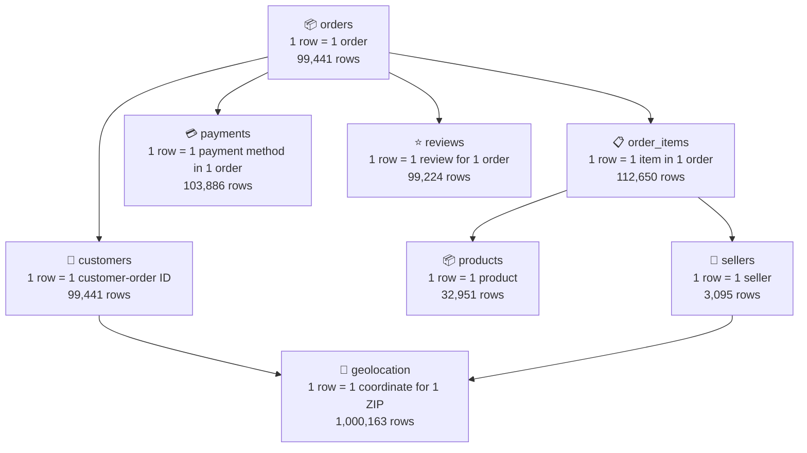

### The Double-Counting Problem 🚨

This is the #1 mistake junior analysts make. Here is exactly what goes wrong:

**Scenario:** One order has 2 items and 2 payment methods.

```
order_items table for this order:   2 rows
payments table for this order:      2 rows

Direct JOIN result:                 2 × 2 = 4 rows ← CATASTROPHICALLY WRONG

GMV counted:    TWICE the real value
Payment total:  TWICE the real value
```

**Real-world impact:** This exact mistake caused multi-million dollar reporting errors at real companies — dashboards showing inflated GMV for months before someone noticed.

**The Fix:**

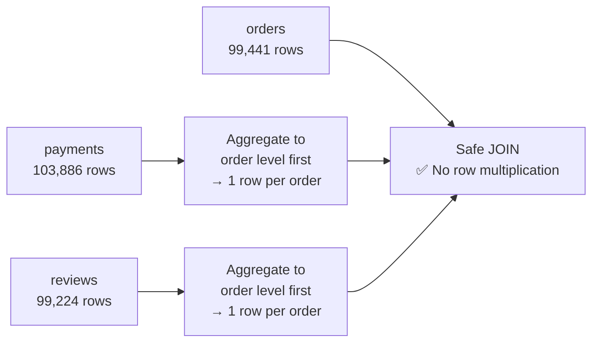

### What We Found From the Real Data

| 🔍 Finding | 📊 Value | ⚠️ Why It Matters |
|---|---|---|
| Total orders | 99,441 | Our base fact table size |
| Total items | 112,650 | 1.13 items/order avg — join risk |
| Repeat customers | 3,345 | Use `customer_unique_id` not `customer_id` |
| Orders with multiple payments | 2,961 | Must aggregate before joining |
| Orders with multiple reviews | 547 | Must aggregate before joining |
| Raw geolocation rows | 1,000,163 | Must reduce to 19,015 unique ZIPs |
| Missing delivery dates | 2,965 | Exclude from delivery time calcs |

### The Two Customer IDs — Explained

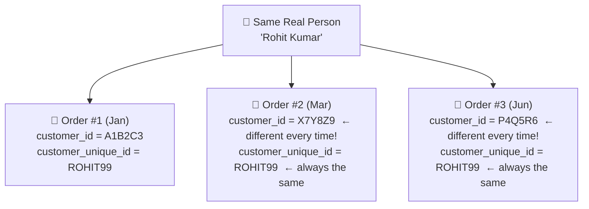

- **Use `customer_id`** → to JOIN orders to the customer table
- **Use `customer_unique_id`** → to count actual real people and find repeat buyers

**Real-world analogy:** `customer_id` is like a new order number (changes every time). `customer_unique_id` is like your phone number (always the same person).

### Table Relationships

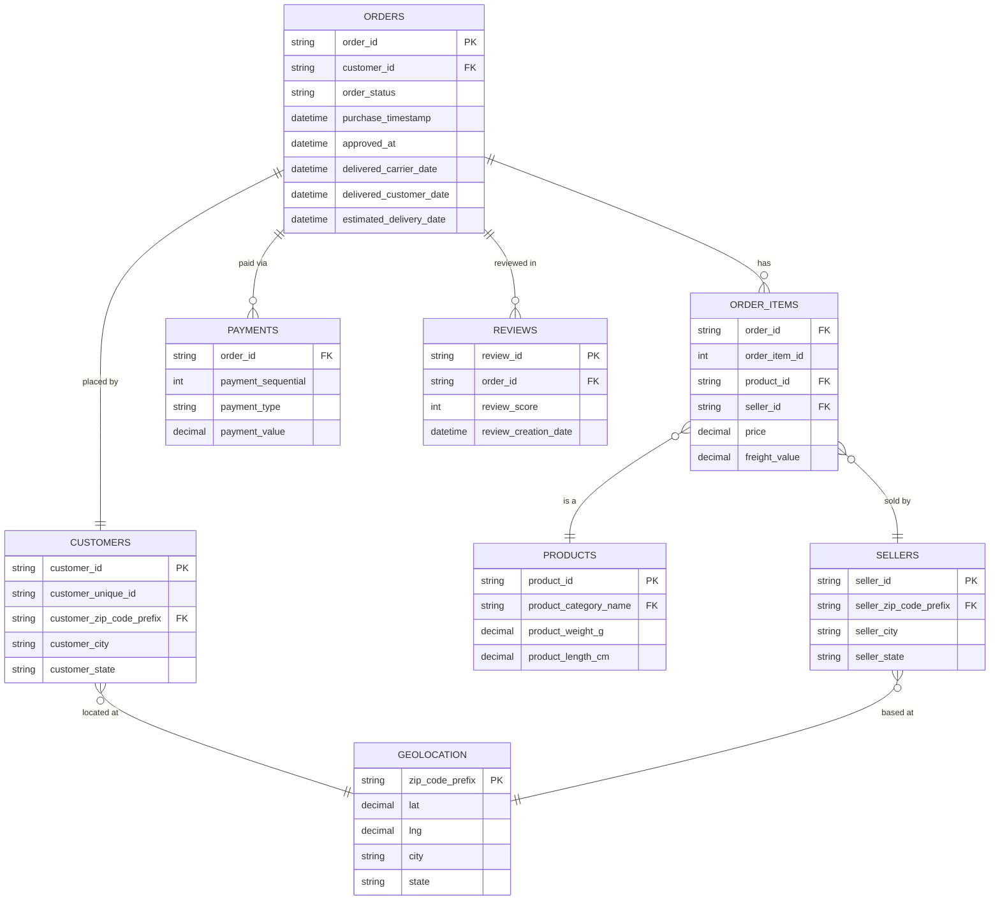

### Source-to-Target Mapping

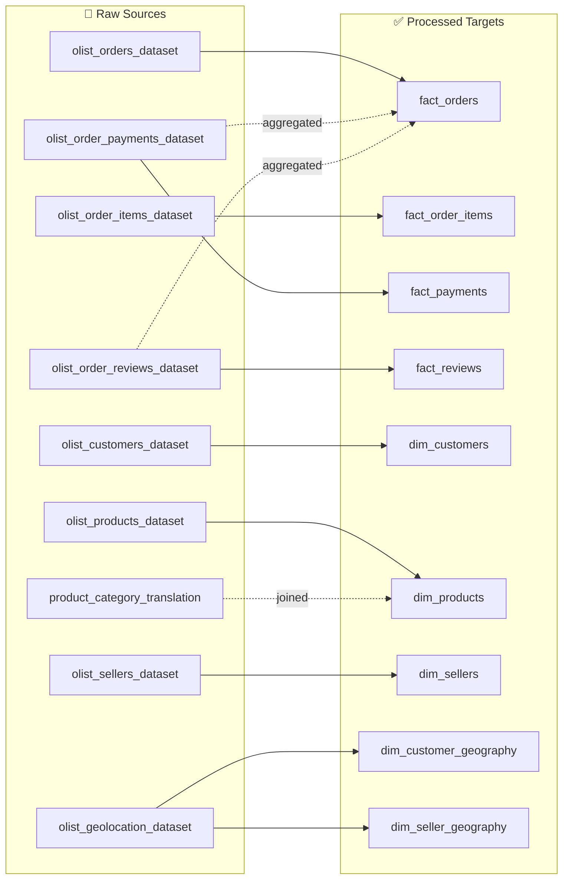

---

## 📖 Key Concepts Glossary

### Star Schema

A data model design where one central **fact table** is surrounded by **dimension tables**. Named "star" because the diagram looks like a star.

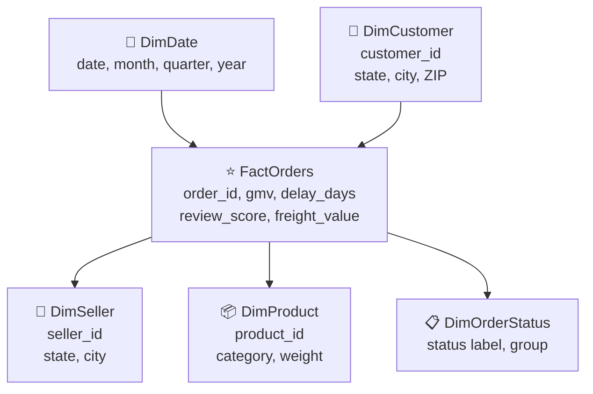

| Type | Contains | Examples |
|---|---|---|
| **Fact Table** | Measurable numbers + foreign keys | GMV, freight, delay days, review score |
| **Dimension Table** | Descriptive labels + attributes | Customer city, product category, seller state |

**Why use star schema in Power BI?**
- Best query performance
- Easiest to understand
- Industry standard — every recruiter recognises it

---

### ETL vs ELT

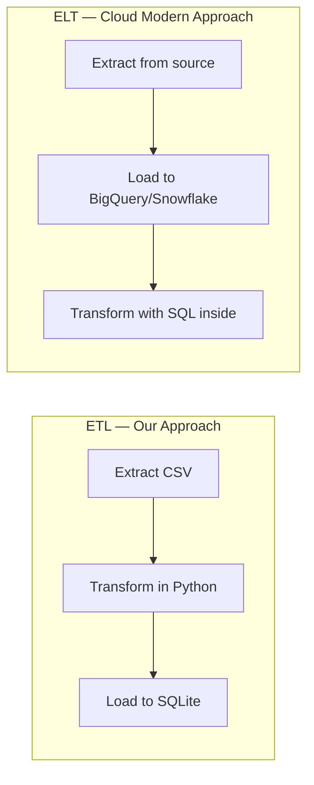

| | ETL | ELT |
|---|---|---|
| Transform happens | Before loading | After loading |
| Best for | On-premise, traditional BI | Cloud warehouses |
| Our project | ✅ This is what we do | |
| Big companies use | | BigQuery, Snowflake, dbt |

---

### Data Lineage

The ability to trace every number in your dashboard back to the original raw CSV row.

```
Dashboard KPI: GMV = ₹13,591,644
    → DAX: GMV = SUM(FactOrderItems[Price])
        → Power BI Model: FactOrderItems table
            → Power Query: stg_OrderItems query
                → Python: 02_cleaning_staging.ipynb
                    → Raw file: olist_order_items_dataset.csv, column: price
```

If someone questions a number, you can trace every step.

---

### Key Metric Definitions

| Metric | Formula | Notes |
|---|---|---|
| **GMV** | `SUM(item_price)` | NOT profit or revenue |
| **Freight Value** | `SUM(freight_value)` | Shipping costs |
| **Total Order Value** | `GMV + Freight` | What customer actually pays |
| **Delivery Days** | `Delivered Date − Purchase Date` | Full end-to-end time |
| **Delay Days** | `Delivered − Estimated` | Negative = early, Positive = late |
| **On-Time Delivery** | `Delivered Date <= Estimated Date` | Boolean per order |
| **On-Time Rate** | `On-Time Orders / Delivered Orders` | Denominator = delivered only |
| **Review Groups** | Positive: 4–5, Neutral: 3, Negative: 1–2 | Analytical grouping |

---

## 🌎 Real-World Analogies

| 🔧 Technical Concept | 🌍 Real-World Analogy |
|---|---|
| **Grain of a table** | What does one supermarket receipt represent? |
| **Star schema** | Hub-and-spoke airport — the hub is the fact table |
| **Virtual environment** | A separate toolbox for each project — no mixing |
| **`.gitignore`** | A "do not pack this" list when moving house |
| **ETL pipeline** | Water treatment plant — pump → clean → distribute |
| **Data lineage** | Food label showing farm, factory, and delivery route |
| **Fact table** | The main content of a book — the actual events |
| **Dimension table** | The chapter headings — they give context |
| **Null value** | A blank cell on a form someone did not fill in |
| **Duplicate row** | The same receipt printed twice |
| **Aggregation** | Totalling a monthly phone bill (many calls → one invoice) |
| **Cardinality** | How many different unique values exist in a column |

---

## 🎤 Interview Cheat Sheet

### "Walk me through your data pipeline."
> "I started by documenting business requirements and KPI definitions. Then I profiled all 9 source tables to understand grain, row counts, nulls, and join risks. I identified three critical join risks — multiple payment rows per order, multiple reviews per order, and 1 million geolocation rows for only 19,000 ZIP codes — and built a cleaning and staging layer in Python. I then integrated the cleaned tables into separate order-level and item-level fact tables, validated every metric in SQL, and built the Power BI star schema on top."

---

### "Why did you use separate fact tables for orders and items?"
> "Because they have different grains. Orders has one row per order while items has one row per each item in an order. Joining them without aggregation inflates order counts and GMV. Keeping them separate lets me calculate order-level metrics correctly from fact_orders and item-level metrics from fact_order_items — zero double counting."

---

### "What is GMV and why is it not profit?"
> "GMV — Gross Merchandise Value — is the total sum of item prices sold on the marketplace. It is not profit or revenue because the platform only earns a commission on each sale, not the full price. We also have no cost data in this dataset, so claiming GMV as profit would be factually incorrect."

---

### "How did you handle the geolocation table?"
> "The raw table had over 1 million rows for only 19,000 unique ZIP prefixes — that is 52 coordinate readings per ZIP on average. I aggregated using median latitude and longitude per ZIP prefix to get one representative coordinate. I used median instead of mean to prevent GPS outlier readings from distorting the location."

---

### "What is on-time delivery rate and how did you calculate it?"
> "On-time delivery rate is the percentage of delivered orders where the actual delivery date was on or before the estimated delivery date. The key is the denominator — I used only delivered orders with valid actual and estimated delivery dates, not all orders. Undelivered or cancelled orders must be excluded, otherwise the rate is artificially deflated."

---

### "Why customer_unique_id instead of customer_id for repeat customers?"
> "The customer_id is created fresh for every new order — even the same person placing three orders gets three different customer_ids. The customer_unique_id persists for the same real person across all orders. Counting distinct customer_ids gives total orders. Counting distinct customer_unique_ids gives actual unique individuals. The dataset has 99,441 customer_ids but only 96,096 unique customers — confirming 3,345 repeat buyers."

---

### "What join risks did you find?"
> "Three main ones. First, payments had 2,961 orders with multiple payment rows — a direct join without aggregation would have doubled those order payment totals. Second, reviews had 547 orders with multiple review rows — same problem. Third, geolocation had 1 million rows for 19,000 ZIP codes — a direct join would multiply customer and seller rows by about 52x. All three required aggregation before joining."

---

---

## 🔬 Phase 3 — Data Profiling

**File created:** [`notebooks/01_source_inventory_and_data_profiling.ipynb`](../notebooks/01_source_inventory_and_data_profiling.ipynb)  
**Script created:** [`src/phase3_profiling.py`](../src/phase3_profiling.py)  
**Output:** [`data/processed/data_quality_report.csv`](../data/processed/data_quality_report.csv)

### What Did We Do?

1. Loaded all 9 raw CSVs and parsed all datetime columns safely
2. Ran table-specific profiling checks on every single source file
3. Tested all primary key uniqueness and composite key uniqueness
4. Detected timestamp sequence errors in the orders table
5. Validated numeric ranges — price, freight, payment values
6. Validated geographic coordinates against Brazil's bounding box
7. Built a 17-row data quality report and saved it to CSV

### Why Data Profiling Before Cleaning?

```
You cannot clean what you don't understand.
You cannot treat a problem you haven't measured.
You cannot document a fix without knowing the root cause.
```

Data profiling is the **diagnostic phase** — like a doctor running blood tests before prescribing medicine. Without profiling, you would be guessing at what to fix.

**Real-world impact:** At companies like Walmart, data profiling runs automatically every night on new data loads. If a column that should have 0 nulls suddenly shows 500 nulls, an alert fires before any analyst or dashboard is affected.

### Key Real Findings From the Actual Data

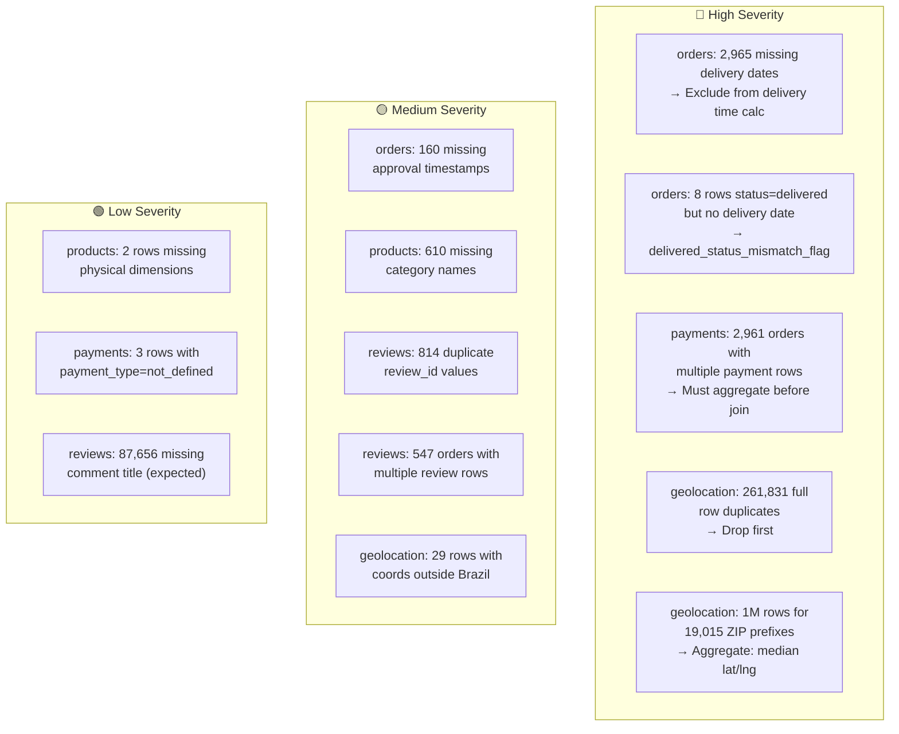

### The Profiling Workflow — Step by Step

```mermaid
flowchart LR
    A["Load CSV\nwith pd.read_csv"] --> B["Parse dates\nwith pd.to_datetime"]
    B --> C["Check shape\nrows x cols"]
    C --> D["Check dtypes\ndf.info()"]
    D --> E["Count nulls\ndf.isnull().sum()"]
    E --> F["Test key uniqueness\ndf.duplicated()"]
    F --> G["Validate ranges\nprice > 0, lat in bounds"]
    G --> H["Check distributions\nvalue_counts()"]
    H --> I["Log finding to\ndata quality report"]
    I --> J["Save CSV\n+ visualise"]
```

### Real Statistics From the Actual Olist Data

| Table | Rows | Key Quality | Critical Finding |
|---|---|---|---|
| orders | 99,441 | ✅ All unique | 2,965 missing delivery dates |
| order_items | 112,650 | ✅ Composite unique | Avg 1.13 items/order |
| customers | 99,441 | ✅ customer_id unique | 3,345 repeat buyers via unique_id |
| products | 32,951 | ✅ All unique | 610 missing category names |
| sellers | 3,095 | ✅ All unique | Clean — no issues |
| payments | 103,886 | ✅ Composite unique | 2,961 orders have 2+ payment rows |
| reviews | 99,224 | ⚠️ 814 duplicate review_ids | 547 orders have 2+ reviews |
| geolocation | 1,000,163 | ❌ Not unique | 52.6 rows per ZIP on average |
| category_translation | 71 | ✅ All unique | 2 product categories untranslatable |

### Review Scores — Real Numbers

| Score | Count | Group | Percentage |
|---|---|---|---|
| 1 ⭐ | 11,424 | 🔴 Negative | 11.5% |
| 2 ⭐ | 3,151 | 🔴 Negative | 3.2% |
| 3 ⭐ | 8,179 | 🟡 Neutral | 8.2% |
| 4 ⭐ | 19,142 | 🟢 Positive | 19.3% |
| 5 ⭐ | 57,328 | 🟢 Positive | 57.8% |

**77.1%** of all reviews are Positive (4 or 5 stars).  
**14.7%** of all reviews are Negative (1 or 2 stars).  
Average review response time: **75.6 hours** (~3.15 days).

### Payment Insights — Real Numbers

| Payment Type | Count | Share |
|---|---|---|
| credit_card | 76,795 | 73.9% |
| boleto | 19,784 | 19.0% |
| voucher | 5,775 | 5.6% |
| debit_card | 1,529 | 1.5% |
| not_defined | 3 | 0.003% |

Average installments: **2.85**. Max installments: **24**.

### GMV Snapshot

```
GMV (sum of all item prices)  : R$ 13,591,644
Total freight value            : R$  2,251,010
Total customer order value     : R$ 15,842,654
Freight as % of GMV            : 16.6%
```

### What Is a Data Quality Report?

A data quality report is a structured table that documents every issue found during profiling:

| Column | What it records |
|---|---|
| Table | Which source file the issue was found in |
| Rule | What exactly the problem is |
| Count | How many rows are affected |
| Pct | What percentage of the table is affected |
| Severity | High / Medium / Low |
| Treatment | Exactly how we will fix it in Phase 4 |

**Why document it?** So the cleaning step in Phase 4 has a clear checklist. Every treatment in Phase 4 maps back to a row in this report. This is standard practice in professional data engineering.

### Pandas Functions Used in Profiling

```python
# Shape — rows and columns
df.shape

# Data types of each column
df.info()
df.dtypes

# Missing value count per column
df.isnull().sum()

# Full row duplicates
df.duplicated().sum()

# Composite key duplicate check
df.duplicated(['order_id', 'order_item_id']).sum()

# Value distribution
df['order_status'].value_counts()

# Numeric statistics
df['price'].describe()

# Group-level aggregation
df.groupby('order_id').size()

# Conditional count (like COUNTIF in Excel)
(df['price'] <= 0).sum()

# Date difference
(df['delivered_date'] - df['purchase_date']).dt.total_seconds() / 86400
```

### Real-World Analogy for Data Profiling

Think of data profiling like a **pre-purchase inspection before buying a used car**:
- You check the odometer (row count)
- You look for rust (null values)
- You check all 4 tyres (data types)
- You test the engine (key uniqueness)
- You check for hidden damage (sequence errors)
- You write a report and decide what to fix before buying

You would never skip the inspection and just drive away. Same logic applies to data.

### Interview Answers — Phase 3

**"How did you assess data quality?"**
> "I ran a structured profiling pass on all 9 source tables before touching any cleaning step. For each table I checked shape, data types, null counts, key uniqueness, value distributions, and domain-specific rules — like whether delivery dates were after purchase dates. I catalogued every finding into a data quality report CSV with severity levels and planned treatments. This gave Phase 4 a clear, auditable checklist to work from."

**"What was the most serious data quality issue you found?"**
> "The geolocation table had 1 million rows for only 19,015 unique ZIP codes — an average of 52 coordinate readings per ZIP prefix. If joined directly without aggregation it would multiply every customer and seller row by 52, making all geographic metrics completely wrong. The fix was aggregating to one representative coordinate per ZIP using median lat/lng before any join."

**"How did you handle the reviews table?"**
> "The review_id column was supposed to be a unique identifier but had 814 duplicate values. Additionally, 547 orders had more than one review row, which would multiply rows on any join. I flagged these in the data quality report and planned two treatments: deduplicate review_id first, then aggregate reviews to order level using the average score per order with a documented rule."

---

## 🧹 Phase 4 — Data Cleaning and Staging Layer

**Notebook created:** [`notebooks/02_data_cleaning_and_staging.ipynb`](../notebooks/02_data_cleaning_and_staging.ipynb)  
**Script created:** [`src/phase4_cleaning_staging.py`](../src/phase4_cleaning_staging.py)  
**Output Directory:** `data/staging/`

### What Did We Do?

1. Built an automated data cleaning and staging pipeline in Python.
2. Standardized text casing, stripped trailing whitespaces, and safely converted datetime columns.
3. Engineered **audit and data quality flags** to identify operational anomalies without throwing away valid business records.
4. Joined English category translations to the Brazilian Portuguese product taxonomy.
5. Calculated physical product features: `product_volume_cm3`, `product_size_band`, and `product_weight_band`.
6. Created **order-level aggregated staging tables** for `payments` and `reviews` to eliminate 1:many cartesian explosion risks during star schema joins.
7. Deduplicated geolocation records and aggregated 1,000,163 GPS readings into **19,010 clean, unique ZIP coordinates** using median statistics.

---

### Why Do We Need a Staging Layer? (The Medallion Architecture)

In modern enterprise data platforms (Databricks, Snowflake, BigQuery), data pipelines follow the **Medallion Architecture**:

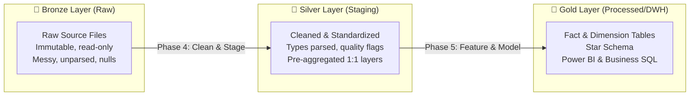

- **Bronze (Raw):** Preserves original history as the single source of truth. Never modified directly.
- **Silver (Staging):** Conformed, standardized, cleaned, enriched with validation flags. (What we built in Phase 4!)
- **Gold (Processed):** Dimensional models ready for BI consumption and executive dashboards.

---

### Overview of Phase 4 Transformations

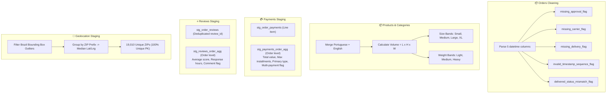

---

### Detailed Breakdown of Staged Datasets

| Staged File | Rows | Columns | Key Transformations Applied |
|---|---|---|---|
| `stg_orders.csv` | 99,441 | 13 | Datetime parsing, 5 quality/sequence audit flags |
| `stg_order_items.csv` | 112,650 | 9 | Numeric validation, `item_total_value`, `freight_to_price_ratio` |
| `stg_customers.csv` | 99,441 | 5 | Title-cased city, uppercase state, preserved dual customer IDs |
| `stg_sellers.csv` | 3,095 | 4 | Standardized city/state strings |
| `stg_products.csv` | 32,951 | 13 | English translation join, `product_volume_cm3`, size/weight bands |
| `stg_order_payments.csv` | 103,886 | 5 | Cleaned payment types (`not_defined` → `unknown`), valid bounds |
| `stg_payments_order_agg.csv` | 99,440 | 6 | **Aggregated to order grain:** total payment, max installments, primary type |
| `stg_order_reviews.csv` | 98,410 | 8 | Deduplicated by `review_id`, response duration in hours calculated |
| `stg_reviews_order_agg.csv` | 98,673 | 6 | **Aggregated to order grain:** average score, latest score, comment flag |
| `stg_geolocation_zip.csv` | 19,010 | 4 | Bounding box filtered, **aggregated to 1 row per ZIP using median coordinate** |

---

### Key Formulas & Logic Applied

#### 1. Data Quality Flags (Orders)
```python
# Sequence errors: delivery before purchase, or carrier before purchase
orders['invalid_timestamp_sequence_flag'] = (
    (orders['order_delivered_customer_date'] < orders['order_purchase_timestamp']) |
    (orders['order_delivered_carrier_date'] < orders['order_purchase_timestamp']) |
    (orders['order_delivered_customer_date'] < orders['order_delivered_carrier_date'])
).fillna(False).astype(int)

# Status says delivered, but timestamp is missing
orders['delivered_status_mismatch_flag'] = (
    (orders['order_status'] == 'delivered') & (orders['order_delivered_customer_date'].isnull())
).astype(int)
```

#### 2. Physical Dimensions & Volume (Products)
$$\text{Product Volume (cm}^3\text{)} = \text{Length (cm)} \times \text{Height (cm)} \times \text{Width (cm)}$$

- **Small:** $< 5,000\text{ cm}^3$ ($< 5\text{ Liters}$)
- **Medium:** $5,000 - 20,000\text{ cm}^3$ ($5 - 20\text{ Liters}$)
- **Large:** $20,000 - 60,000\text{ cm}^3$ ($20 - 60\text{ Liters}$)
- **Extra Large:** $\ge 60,000\text{ cm}^3$ ($\ge 60\text{ Liters}$)

#### 3. Primary Payment Type Logic (Payments)
When a customer splits an order across multiple payment types (e.g. Voucher + Credit Card):
$$\text{Primary Payment Type} = \text{Payment Method with the Highest Monetary Value}$$

#### 4. Geolocation Median Aggregation
$$\text{Latitude}_{\text{ZIP}} = \text{Median}(\text{Latitudes of that ZIP}), \quad \text{Longitude}_{\text{ZIP}} = \text{Median}(\text{Longitudes of that ZIP})$$
*Using median instead of mean prevents erroneous GPS readings (e.g. phone glitches outside Brazil) from shifting the geographic center.*

---

### Real-World Analogy for Phase 4

Think of the Staging Layer like a **professional restaurant kitchen prep line (Mise en Place)**:
- **Raw Layer (Bronze):** Bulk vegetables and unwashed ingredients arrive from the supplier with dirt and packaging.
- **Staging Layer (Silver):** The prep cooks wash, peel, chop, weigh, and portion every ingredient into clean, standardized containers. Bad vegetables are flagged or trimmed, and spices are pre-measured.
- **Processed Layer (Gold):** The executive chef can now cook meals (build models and dashboards) instantly without stopping to wash or trim vegetables.

---

### Interview Answers — Phase 4

**"Why did you create quality flags instead of deleting bad rows in Phase 4?"**
> "In an enterprise environment, deleting rows with missing delivery dates or sequence anomalies destroys financial records. An order with a missing delivery date might still represent R$ 500 in real GMV and customer payments. By adding boolean flags (`missing_delivery_flag`, `invalid_timestamp_sequence_flag`), we preserve full financial integrity for revenue reporting while enabling downstream logistics queries to filter for valid delivery records safely."

**"How did you solve the grain mismatch when joining payments and reviews to orders?"**
> "I built dual staging outputs for payments and reviews: a detailed line-item table and an order-level pre-aggregated table. For payments, the aggregated table calculates total payment value, max installments, and determines the primary payment method. This converted a 1-to-many relationship into a clean 1-to-1 relationship, ensuring that joining payments to orders never duplicates order counts or inflates GMV."

**"Why did you use median rather than mean for geolocation coordinates?"**
> "GPS coordinates collected from mobile devices and carrier pings frequently contain extreme outlier noise (e.g. towers momentarily registering coordinates in the ocean or overseas). The mean is highly sensitive to outliers, which would shift the estimated location of an entire ZIP code. The median is robust to extreme values and accurately represents the true central geographic point of each ZIP prefix."

---

## 🏗️ Phase 5 — Data Integration & Feature Engineering

**Notebook created:** [`notebooks/03_data_integration_and_feature_engineering.ipynb`](../notebooks/03_data_integration_and_feature_engineering.ipynb)  
**Script created:** [`src/phase5_integration_features.py`](../src/phase5_integration_features.py)  
**Output Directory:** `data/processed/`

### What Did We Do?

1. Integrated staged datasets into a complete enterprise **Star Schema** following Kimball dimensional modeling principles.
2. Built **`fact_orders`** at order grain (99,441 rows) enriched with operational KPIs, aggregated financial summaries, and review metrics.
3. Built **`fact_order_items`** at line-item grain (112,650 rows) with product details, seller locations, and geospatial shipment distance.
4. Calculated end-to-end fulfillment milestone durations (approval, handling, transit, total delivery, promised delivery, and delay days).
5. Computed Great-Circle **Haversine Distance** (in kilometers) between seller and customer ZIP centroids.
6. Aggregated customer history into **`dim_customers`** using `customer_unique_id` to track repeat buying behavior, lifetime value (LTV), and satisfaction.
7. Generated **`dim_sellers`** (Seller Performance Scorecard) tracking on-time delivery rate %, total GMV, delay averages, and state coverage.
8. Created a corporate calendar table **`dim_date`** (1,096 days from 2016 to 2018) for Power BI time intelligence.

---

### Star Schema Architecture (The Gold Layer)

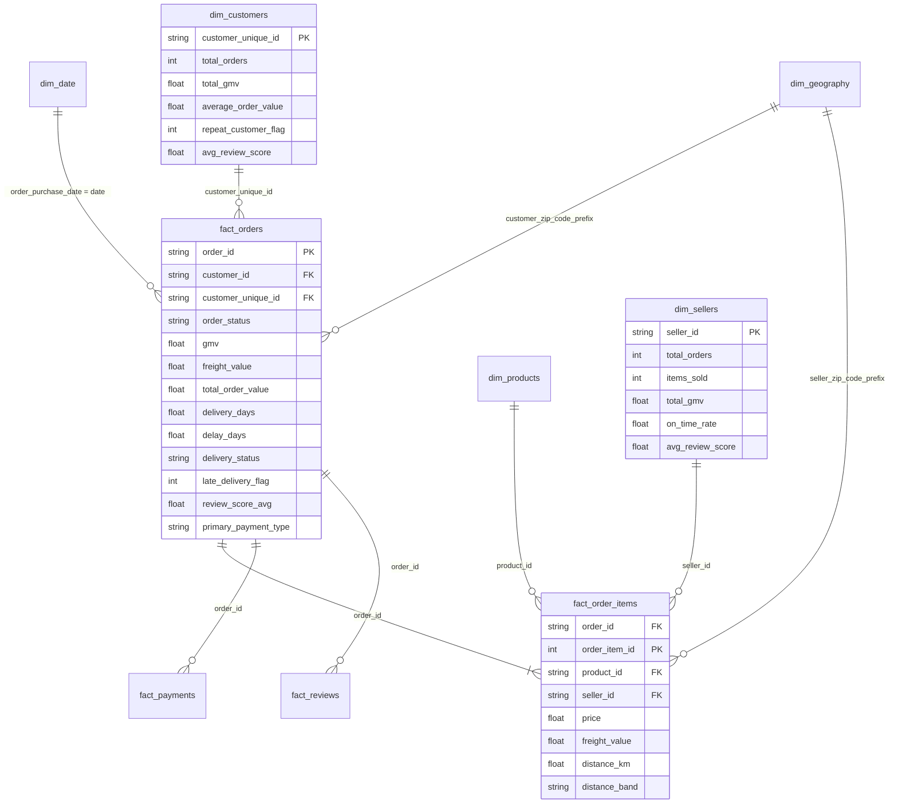

---

### Order Fulfillment Lifecycle & Duration Engineering

Every e-commerce order progresses through distinct operational stages:

```mermaid
flowchart LR
    P["🛒 Purchase\n(order_purchase_timestamp)"]
    A["💳 Approval\n(order_approved_at)"]
    C["📦 Carrier Handover\n(order_delivered_carrier_date)"]
    D["🏠 Delivered to Customer\n(order_delivered_customer_date)"]
    E["📅 Promised Target\n(order_estimated_delivery_date)"]

    P -->|approval_hours| A
    A -->|handling_days| C
    C -->|transit_days| D
    P -->|delivery_days (Total SLA)| D
    D -.->|delay_days = Actual - Promised| E
```

#### Duration Formulas
- **Approval Duration (hours):**
  $$\text{approval\_hours} = \frac{\text{order\_approved\_at} - \text{order\_purchase\_timestamp}}{3600}$$
- **Handling Duration (days):**
  $$\text{handling\_days} = \frac{\text{order\_delivered\_carrier\_date} - \text{order\_approved\_at}}{86400}$$
- **Transit Duration (days):**
  $$\text{transit\_days} = \frac{\text{order\_delivered\_customer\_date} - \text{order\_delivered\_carrier\_date}}{86400}$$
- **Total Fulfillment Duration (days):**
  $$\text{delivery\_days} = \frac{\text{order\_delivered\_customer\_date} - \text{order\_purchase\_timestamp}}{86400}$$
- **Promised Duration (days):**
  $$\text{promised\_delivery\_days} = \frac{\text{order\_estimated\_delivery\_date} - \text{order\_purchase\_timestamp}}{86400}$$
- **Operational Delay (days):**
  $$\text{delay\_days} = \frac{\text{order\_delivered\_customer\_date} - \text{order\_estimated\_delivery\_date}}{86400}$$

---

### Geospatial Distance: The Haversine Formula

To analyze the relationship between shipping distance, freight cost, and delivery SLA, we calculate the great-circle distance between the seller's ZIP code centroid and the customer's ZIP code centroid on Earth:

$$d = 2 R \arcsin\left(\sqrt{\sin^2\left(\frac{\Delta \phi}{2}\right) + \cos(\phi_1)\cos(\phi_2)\sin^2\left(\frac{\Delta \lambda}{2}\right)}\right)$$

Where:
- $R = 6,371\text{ km}$ (mean radius of Earth)
- $\phi_1, \phi_2$ = Seller and Customer latitudes in radians
- $\Delta \phi = \phi_2 - \phi_1$ (latitude difference)
- $\Delta \lambda = \lambda_2 - \lambda_1$ (longitude difference)

#### Distance Categorization Bands
- `0–100 km`: Local / Same Metro Area
- `101–500 km`: Regional / Neighboring States
- `501–1,000 km`: Inter-Regional
- `1,001–2,000 km`: Long-Haul
- `2,000+ km`: Cross-Country (e.g. South/Southeast to North/Northeast)

---

### Processed Datasets (Gold Layer) Inventory

| Table Name | Type | Grain | Rows | Key Business Metrics |
|---|---|---|---|---|
| `fact_orders.csv` | Fact | 1 row per `order_id` | 99,441 | GMV, freight, delivery days, delay days, on-time flag, review score |
| `fact_order_items.csv` | Fact | 1 row per `order_item_id` | 112,650 | Price, freight, seller distance (km), product volume, weight |
| `fact_payments.csv` | Fact | 1 row per payment record | 103,886 | Payment method, installment count, transaction value |
| `fact_reviews.csv` | Fact | 1 row per review record | 98,410 | Star score, review creation/response duration |
| `dim_customers.csv` | Dimension | 1 row per `customer_unique_id` | 96,096 | Total orders, lifetime GMV, AOV, repeat buyer flag, average rating |
| `dim_sellers.csv` | Dimension | 1 row per `seller_id` | 3,095 | Orders fulfilled, items sold, on-time rate %, average rating, reach |
| `dim_products.csv` | Dimension | 1 row per `product_id` | 32,951 | English category, dimensions, volume band, weight band |
| `dim_geography.csv` | Dimension | 1 row per `zip_code_prefix` | 19,010 | Median latitude/longitude, city, state |
| `dim_date.csv` | Dimension | 1 row per calendar day | 1,096 | Year, quarter, month, day of week, weekend indicator |

---

### Key Findings from Phase 5 Engineering

1. **Overall GMV:** The total Gross Merchandise Value is **R$ 13,591,643.70** across 99,441 orders.
2. **On-Time Delivery Performance:** **91.89%** of delivered orders arrived on or before the promised estimated delivery date.
3. **Average Shipping Distance:** The average shipment traveled **596.7 km** across Brazil's territory.
4. **Repeat Customer Rate:** Out of 96,096 unique individuals, only **2,997 customers (3.12%)** placed more than 1 order, highlighting a major opportunity for customer retention and loyalty programs.

---

### Real-World Analogy for Phase 5

Think of Dimensional Modeling like a **modern department store vs a chaotic warehouse**:
- **OLTP / Raw Data:** A massive warehouse where items are dumped in raw crates as they arrive from trucks. Finding all winter coats sold to customers in São Paulo requires searching every corner of the building.
- **Dimensional Model (Star Schema):** A beautifully organized retail department store.
  - In the center of the room are the **cash registers (Fact Tables)** recording every purchase transaction.
  - Arranged neatly around the perimeter are the **aisles (Dimension Tables)**: Customer desk, Product shelves, Seller directories, and Calendar schedules.
  - Any manager can answer business questions in seconds simply by linking the register ticket to the surrounding aisles.

---

### Interview Answers — Phase 5

**"Why did you choose a Star Schema over a 3NF normalized schema for this project?"**
> "In analytical and BI systems like Power BI and SQL data warehouses, query performance and simplicity are paramount. A 3NF normalized schema requires 8 to 10 table joins for basic reporting, which creates slow DAX calculations and complex relationships. By adopting a Kimball Star Schema with central fact tables (`fact_orders`, `fact_order_items`) and conformed dimensions (`dim_customers`, `dim_sellers`, `dim_products`, `dim_date`), we optimized for fast aggregations, intuitive slice-and-dice exploration, and efficient columnar storage."

**"Why do you have two fact tables (`fact_orders` and `fact_order_items`) instead of just one?"**
> "They exist at different business grains. `fact_orders` is at the order level (1 row per order) and serves executive, revenue, and delivery SLA reporting without needing row-multiplying item joins. `fact_order_items` is at the individual line-item grain (1 row per item), which is essential for SKU-level product analysis, seller scorecards, and multi-item basket economics. Keeping both grains cleanly separated avoids aggregation errors and cartesian joins."

**"How did you calculate shipping distance and what did it reveal?"**
> "Using the median coordinates of customer and seller ZIP code prefixes, I implemented the Haversine formula to compute great-circle distance in kilometers. This revealed that the average shipment traveled approximately 597 km. By grouping distances into operational tiers (0–100 km, 101–500 km, etc.), we enabled logistics teams to analyze the exact correlation between shipping distance, transit days, freight costs, and late delivery risk."

---

> 📌 **This document is continuously updated as we complete each project phase.**

---

*Project:* Enterprise E-Commerce Operations and Customer Experience Control Tower  
*Dataset:* Brazilian E-Commerce Public Dataset by Olist — Kaggle  
*Tech Stack:* Python · Pandas · NumPy · Matplotlib · SQLite · SQLAlchemy · Power BI · DAX · Power Query · Git · GitHub
