# 📚 End-to-End Data Analytics Project — Complete Learning Guide

> **This document grows with the project.** Every phase we complete, this file gets updated with what we did, why we did it, how it works, where it is used in the real world, and how to explain it in an interview.

---

## 🗺️ Table of Contents

| # | Section |
|---|---|
| 1 | [What Is This Project?](#-1-what-is-this-project) |
| 2 | [The Big Picture Architecture](#-2-the-big-picture-architecture) |
| 3 | [Tools and Why We Use Them](#-3-tools-and-why-we-use-them) |
| 4 | [Phase 0 — Business Requirements](#-phase-0--business-requirements) |
| 5 | [Phase 1 — Environment Setup](#-phase-1--environment-setup) |
| 6 | [Phase 2 — Source Inventory and Grain Analysis](#-phase-2--source-inventory-and-grain-analysis) |
| 7 | [Key Concepts Glossary](#-key-concepts-glossary) |
| 8 | [Real-World Analogies](#-real-world-analogies) |
| 9 | [Interview Cheat Sheet](#-interview-cheat-sheet) |

---

## 🎯 1. What Is This Project?

### What?
We are building an **Enterprise E-Commerce Operations and Customer Experience Control Tower** using the **Brazilian E-Commerce Public Dataset by Olist** with 9 interconnected tables covering ~100,000 real orders from 2016–2018.

This is **NOT** a simple sales dashboard. It is a full operational intelligence system that answers five fundamental business questions:

```
1. What is happening?          → Executive KPIs, GMV, order status
2. Where is the problem?       → Geography, seller, category breakdown
3. Why might it be happening?  → Decomposition Tree, Key Influencers
4. Who is affected?            → Sellers, customers, categories, states
5. What action to take?        → Recommendations, What-If scenarios
```

### Why Does This Project Matter?

In the real world, e-commerce companies like **Flipkart, Amazon, Meesho, and Nykaa** have data flowing from multiple disconnected systems simultaneously:

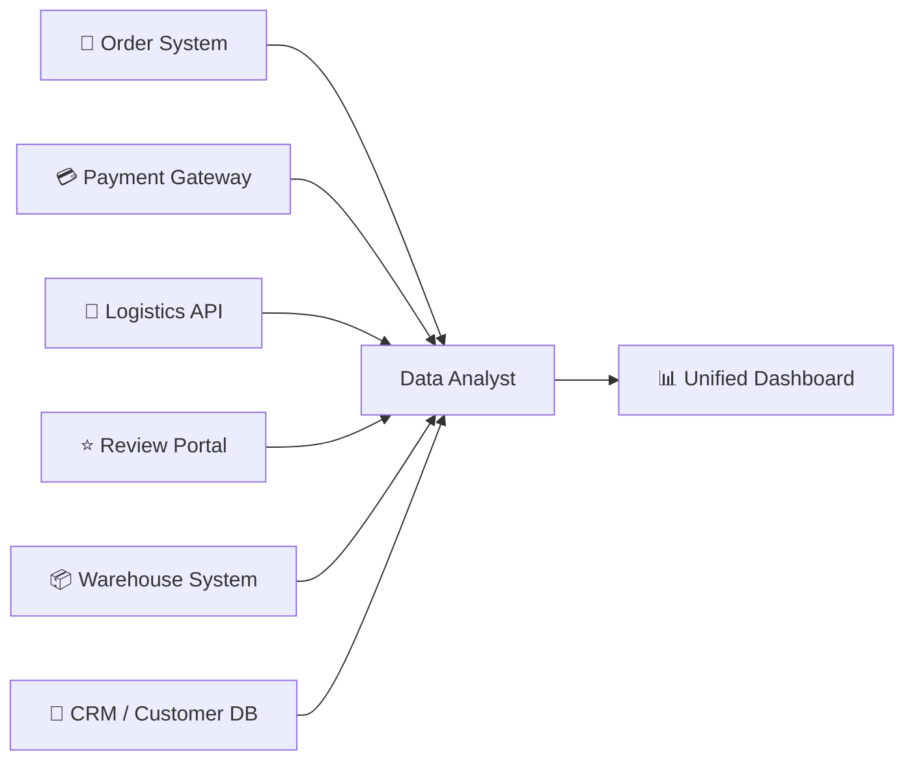

A data analyst's job is to connect all of these scattered systems and tell one clear, accurate story. This project simulates exactly that.

### Who Uses the Final Dashboard?

| 👤 Stakeholder | 🎯 What They Need |
|---|---|
| E-commerce Operations Manager | Order volumes, delivery SLA, cancellations |
| Logistics Manager | On-time rate, delay hotspots by state |
| Seller Management Team | Seller scorecard — GMV, delivery, reviews |
| Customer Experience Team | Review scores, negative review drivers |
| Category Manager | Category GMV, freight ratio, satisfaction |
| Executive Management | Monthly GMV trend, overall KPI summary |

### Where Is This Used in the Real World?

| 🏢 Company | 🔍 Use Case |
|---|---|
| Flipkart / Amazon India | Operations dashboards tracking lakh-scale daily shipments |
| Swiggy / Zomato | Delivery SLA monitoring — which restaurants cause delays |
| Meesho | Seller quality scorecard rating 1 lakh+ sellers |
| Nykaa / Myntra | Category performance by GMV and return rate |
| Any D2C Brand | Shopify + logistics API → Power BI to see daily order health |

---

## 🏗️ 2. The Big Picture Architecture

### End-to-End Flow

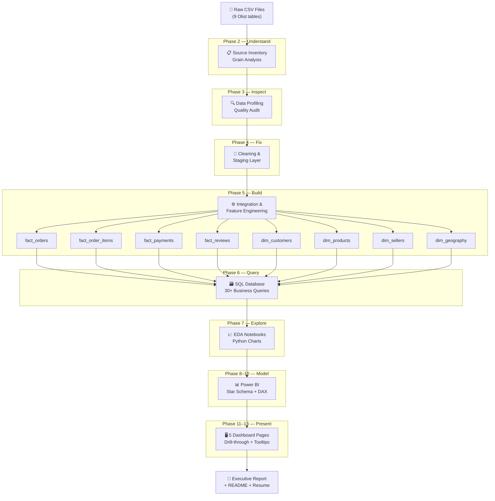

### Why This Specific Order?

> You cannot clean data before understanding it.
> You cannot model data before cleaning it.
> You cannot write DAX before modeling.

Each phase **depends on the one before it.** This is how professional data pipelines are built.

---

## 🛠️ 3. Tools and Why We Use Them

### Technology Stack at a Glance

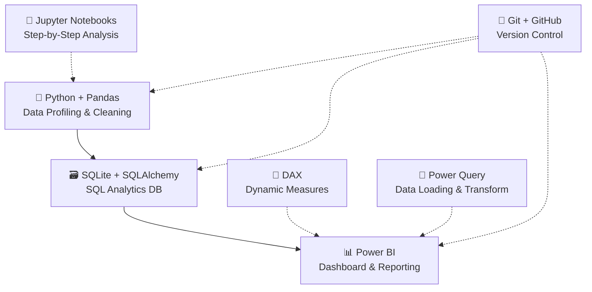

---

### 🐍 Python + Pandas

**What is it?**
Python is a programming language. Pandas is its most powerful library for working with tabular data — like Excel but 100× more powerful.

**Why we use it:**
- Handles millions of rows without crashing (Excel breaks at ~1M rows)
- Automates checks across all 9 files in seconds
- Joins, transforms, and engineers features from multiple tables

**Where it is used in real companies:**

| Company | How They Use Python |
|---|---|
| Walmart | Clean 50M+ product records for their catalog |
| Zomato | Join order, delivery, and restaurant tables |
| Paytm | Fraud detection on payment transaction data |
| Google | Every internal analytics pipeline |

**Key commands:**

```python
df.shape           # How many rows and columns?
df.info()          # What are the data types?
df.isnull().sum()  # How many missing values per column?
df.duplicated()    # Any duplicate rows?
df.describe()      # Min, max, mean, std statistics
df.groupby()       # Aggregate — like SQL GROUP BY
pd.merge()         # Join two tables — like SQL JOIN
```

---

### 🗃️ SQL + SQLite

**What is it?**
SQL (Structured Query Language) is the universal language for querying relational databases.
SQLite is a lightweight database engine — the entire database is one `.db` file.

**Why SQL is non-negotiable:**

```
90% of data analyst job descriptions mention SQL as a required skill.
SQL is used on every database platform — MySQL, PostgreSQL, BigQuery, Snowflake.
```

**Key SQL concepts we will use:**

```sql
-- Basic query
SELECT order_id, order_status, order_purchase_timestamp
FROM fact_orders
WHERE order_status = 'delivered';

-- Aggregation (GROUP BY)
SELECT seller_state, COUNT(*) AS total_orders, SUM(gmv) AS total_gmv
FROM fact_orders
GROUP BY seller_state
ORDER BY total_gmv DESC;

-- Window Function (RANK)
SELECT seller_id, gmv,
       RANK() OVER (ORDER BY gmv DESC) AS gmv_rank
FROM seller_scorecard;

-- CTE (reusable subquery)
WITH on_time AS (
    SELECT order_id
    FROM fact_orders
    WHERE delivered_date <= estimated_date
)
SELECT COUNT(*) FROM on_time;
```

**Real-world usage:**

| Analyst Role | SQL Platform |
|---|---|
| Flipkart Data Analyst | Google BigQuery |
| Bank Risk Analyst | Oracle / SQL Server |
| Startup Analyst | PostgreSQL / MySQL |
| Data Scientist | Snowflake / Redshift |

---

### 📊 Power BI

**What is it?**
Microsoft Power BI is the industry-standard business intelligence tool used to build interactive dashboards for non-technical stakeholders.

**5 Power BI features we will build:**

| Feature | What It Does |
|---|---|
| Decomposition Tree | Visually breaks down a metric by multiple dimensions to find root causes |
| Key Influencers | Shows which factors most influence a target metric (e.g., low review score) |
| What-If Parameter | Lets the user simulate "what if on-time rate improves to 95%?" |
| Drill-through | Right-click a seller → see a detailed seller-specific page |
| Report-page Tooltips | Hover over a bar → see a mini-dashboard popup |

**Where it is used:**

| Company Type | Use Case |
|---|---|
| Reliance Retail | Store-level sales monitoring across India |
| TCS / Infosys | Client delivery SLA dashboards |
| HDFC Bank | Loan portfolio performance tracking |
| Any enterprise | Monthly executive KPI reporting |

---

### 🧮 DAX (Data Analysis Expressions)

**What is it?**
DAX is Power BI's formula language for creating dynamic calculated metrics.

**Why not just hardcode the numbers?**

Because filters change everything. When a manager filters to "SP (São Paulo) sellers only" + "Q1 2018," every single KPI must recalculate automatically. DAX does this instantly.

**Example DAX measures we will write:**

```dax
// Total GMV
GMV = SUM(FactOrderItems[Price])

// On-Time Delivery Rate
On-Time Delivery Rate =
DIVIDE(
    CALCULATE([Delivered Orders], FactOrders[LateDeliveryFlag] = 0),
    [Delivered Orders],
    0
)

// Month-over-Month GMV Growth
MoM GMV Growth % =
DIVIDE(
    [GMV] - [Previous Month GMV],
    [Previous Month GMV],
    0
)
```

---

### 🔗 Git + GitHub

**What is it?**
Git tracks every change you make to your project files — like "track changes" in Word but for code. GitHub hosts the project online for the world (and recruiters) to see.

**How commits tell your project story:**

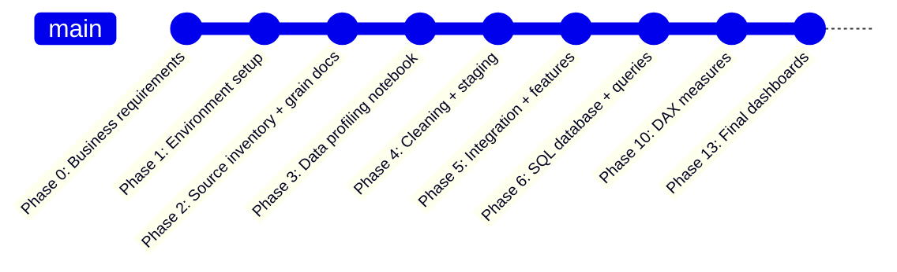

Each commit proves you built it step by step — not a copy-paste job.

---

## 📋 Phase 0 — Business Requirements

**File created:** [`docs/business_requirements.md`](./business_requirements.md)

### What Did We Do?
Created a document that defines what this project must deliver **before writing a single line of code.**

### Why Does This Phase Matter?

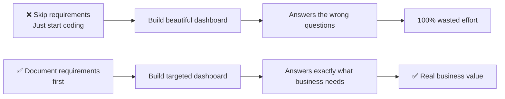

### What Is in Our Business Requirements?

**1. Stakeholders** — 7 types of people who use this dashboard

**2. Business Questions (20+)** grouped by domain:

```
Executive  → How many orders? What is GMV? What is the trend?
Delivery   → What is the on-time rate? Which states have high delays?
CX         → What is the average review score? What drives low scores?
Seller     → Which sellers have high GMV but poor delivery?
Payments   → Which payment types dominate? What is avg installments?
```

**3. Metric Definitions** — Exact formulas agreed upfront:

| Metric | Formula |
|---|---|
| GMV | `SUM(item_price)` |
| Freight Value | `SUM(freight_value)` |
| Total Customer Order Value | `GMV + Freight Value` |
| Delivery Time | `Delivered Date − Purchase Date` |
| Delay Days | `Actual Delivery − Estimated Delivery` |
| On-Time Delivery | `Actual Date <= Estimated Date` |
| Review Groups | Positive (4–5), Neutral (3), Negative (1–2) |

**4. Out of Scope:**
- Profit (no cost data in the dataset)
- Real-time tracking (static historical dataset)
- Exact carrier analysis (no carrier ID in data)
- Causal claims (correlation ≠ causation)

### Real-World Analogy
Ordering food at a restaurant. The business requirements document is the **order you place before the kitchen starts cooking**. Without a clear order, the kitchen (data team) guesses — and you get the wrong food.

---

## ⚙️ Phase 1 — Environment Setup

### What Did We Do?

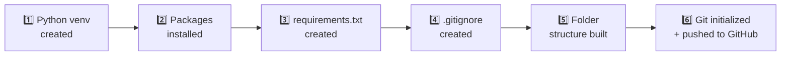

### Why a Virtual Environment?

**The Problem Without It:**

```
Your System Python
├── Project A needs pandas 1.5  ← conflicts!
└── Project B needs pandas 2.0  ← conflicts!
= Both projects break
```

**The Solution With It:**

```
.venv (this project only)
└── pandas 3.0, numpy 2.5, matplotlib 3.11... (exact versions, isolated)

Other Project/.venv
└── completely separate packages, no conflict
```

**Real-world analogy:** A separate toolbox for each construction project. No mixing. No breaking each other's tools.

### Why `.gitignore`?

| Ignored Item | Reason |
|---|---|
| `.venv/` | 200MB+ folder — recreatable from `requirements.txt` |
| `*.csv` | Geolocation CSV alone is 61MB — GitHub limit is 100MB |
| `*.db` | SQLite database files |
| `*.pbix` | Power BI binary files |
| `__pycache__/` | Python auto-generated temp files |

> **Golden Rule:** Never push sensitive data (emails, passwords, API keys) or massive binary files to GitHub.

### Folder Structure and Why

```
ecommerce-control-tower/
├── 📁 data/
│   ├── raw/       ← SACRED: original files, never modified
│   ├── staging/   ← cleaned versions of raw
│   └── processed/ ← final fact + dimension tables
├── 📓 notebooks/  ← Jupyter analysis (one per phase)
├── 🐍 src/        ← reusable Python helper scripts
├── 🗃️ sql/        ← 30+ business queries
├── 🗄️ database/   ← SQLite .db file
├── 📊 powerbi/    ← .pbix + screenshots
├── 📄 reports/    ← executive insights report
├── 📚 docs/       ← all documentation
└── 🖼️ assets/     ← diagrams and images
```

**Why separate `raw` from `staging` from `processed`?**

This is called **data lineage** — always being able to trace a number back to its source. If the CFO questions a GMV figure, you can show:

```
Dashboard number
  → DAX measure
    → Power BI model
      → SQL query
        → Python staging output
          → Original raw CSV row
```

Professional data teams treat raw data as **read-only** forever.

---

## 🔍 Phase 2 — Source Inventory and Grain Analysis

**Files created:**
- [`docs/source_inventory.md`](./source_inventory.md)
- [`docs/relationship_and_grain_document.md`](./relationship_and_grain_document.md)

### What Did We Do?

1. Ran Python profiling on all 9 CSV files
2. Tested uniqueness of every candidate primary key
3. Found 5 critical join risks that would cause wrong numbers
4. Documented all table relationships

### The Most Important Concept — GRAIN 🌾

**What is grain?**
The answer to: **"What does one row in this table represent?"**

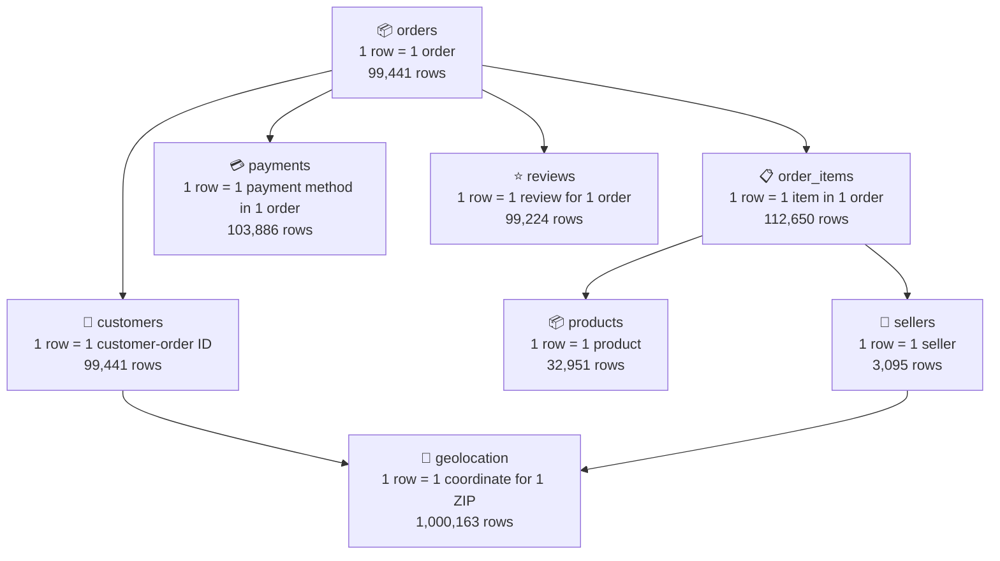

### The Double-Counting Problem 🚨

This is the #1 mistake junior analysts make. Here is exactly what goes wrong:

**Scenario:** One order has 2 items and 2 payment methods.

```
order_items table for this order:   2 rows
payments table for this order:      2 rows

Direct JOIN result:                 2 × 2 = 4 rows ← CATASTROPHICALLY WRONG

GMV counted:    TWICE the real value
Payment total:  TWICE the real value
```

**Real-world impact:** This exact mistake caused multi-million dollar reporting errors at real companies — dashboards showing inflated GMV for months before someone noticed.

**The Fix:**

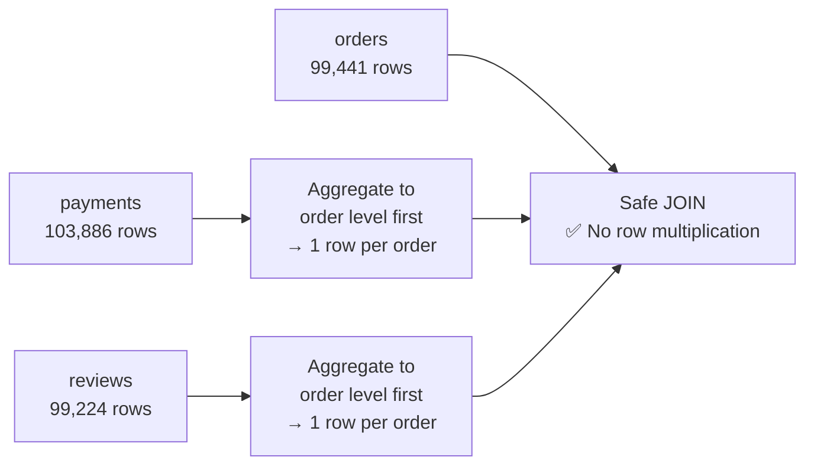

### What We Found From the Real Data

| 🔍 Finding | 📊 Value | ⚠️ Why It Matters |
|---|---|---|
| Total orders | 99,441 | Our base fact table size |
| Total items | 112,650 | 1.13 items/order avg — join risk |
| Repeat customers | 3,345 | Use `customer_unique_id` not `customer_id` |
| Orders with multiple payments | 2,961 | Must aggregate before joining |
| Orders with multiple reviews | 547 | Must aggregate before joining |
| Raw geolocation rows | 1,000,163 | Must reduce to 19,015 unique ZIPs |
| Missing delivery dates | 2,965 | Exclude from delivery time calcs |

### The Two Customer IDs — Explained

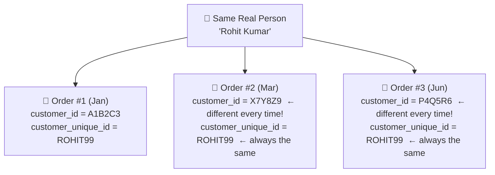

- **Use `customer_id`** → to JOIN orders to the customer table
- **Use `customer_unique_id`** → to count actual real people and find repeat buyers

**Real-world analogy:** `customer_id` is like a new order number (changes every time). `customer_unique_id` is like your phone number (always the same person).

### Table Relationships

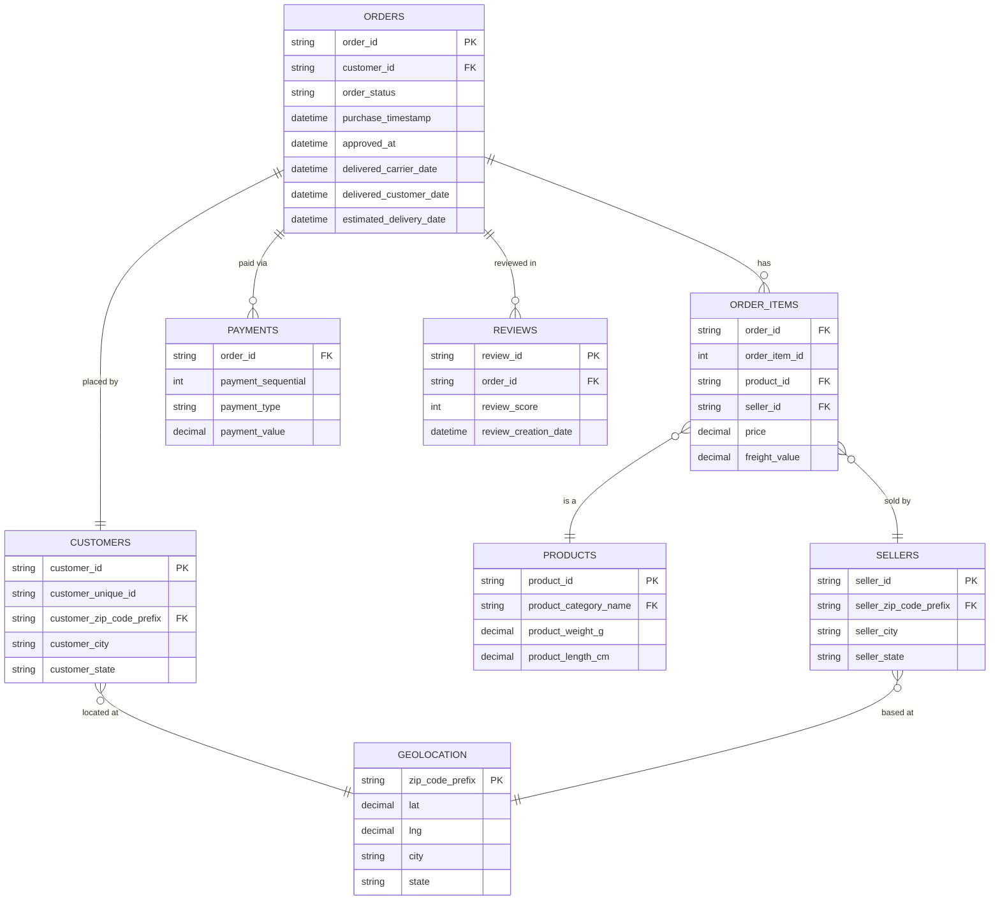

### Source-to-Target Mapping

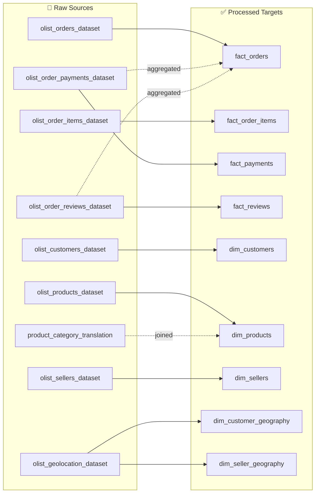

---

## 📖 Key Concepts Glossary

### Star Schema

A data model design where one central **fact table** is surrounded by **dimension tables**. Named "star" because the diagram looks like a star.

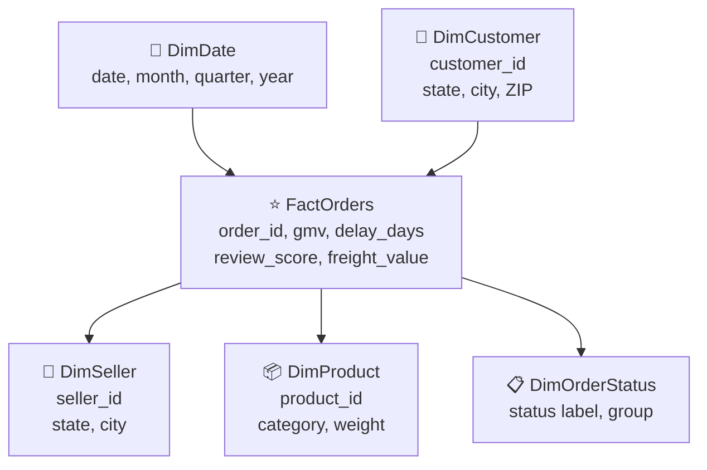

| Type | Contains | Examples |
|---|---|---|
| **Fact Table** | Measurable numbers + foreign keys | GMV, freight, delay days, review score |
| **Dimension Table** | Descriptive labels + attributes | Customer city, product category, seller state |

**Why use star schema in Power BI?**
- Best query performance
- Easiest to understand
- Industry standard — every recruiter recognises it

---

### ETL vs ELT

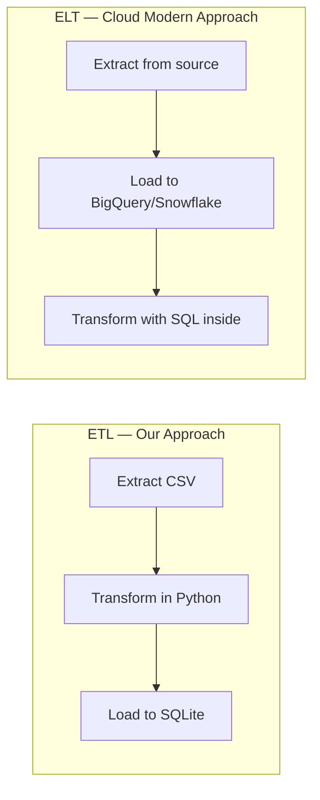

| | ETL | ELT |
|---|---|---|
| Transform happens | Before loading | After loading |
| Best for | On-premise, traditional BI | Cloud warehouses |
| Our project | ✅ This is what we do | |
| Big companies use | | BigQuery, Snowflake, dbt |

---

### Data Lineage

The ability to trace every number in your dashboard back to the original raw CSV row.

```
Dashboard KPI: GMV = ₹13,591,644
    → DAX: GMV = SUM(FactOrderItems[Price])
        → Power BI Model: FactOrderItems table
            → Power Query: stg_OrderItems query
                → Python: 02_cleaning_staging.ipynb
                    → Raw file: olist_order_items_dataset.csv, column: price
```

If someone questions a number, you can trace every step.

---

### Key Metric Definitions

| Metric | Formula | Notes |
|---|---|---|
| **GMV** | `SUM(item_price)` | NOT profit or revenue |
| **Freight Value** | `SUM(freight_value)` | Shipping costs |
| **Total Order Value** | `GMV + Freight` | What customer actually pays |
| **Delivery Days** | `Delivered Date − Purchase Date` | Full end-to-end time |
| **Delay Days** | `Delivered − Estimated` | Negative = early, Positive = late |
| **On-Time Delivery** | `Delivered Date <= Estimated Date` | Boolean per order |
| **On-Time Rate** | `On-Time Orders / Delivered Orders` | Denominator = delivered only |
| **Review Groups** | Positive: 4–5, Neutral: 3, Negative: 1–2 | Analytical grouping |

---

## 🌎 Real-World Analogies

| 🔧 Technical Concept | 🌍 Real-World Analogy |
|---|---|
| **Grain of a table** | What does one supermarket receipt represent? |
| **Star schema** | Hub-and-spoke airport — the hub is the fact table |
| **Virtual environment** | A separate toolbox for each project — no mixing |
| **`.gitignore`** | A "do not pack this" list when moving house |
| **ETL pipeline** | Water treatment plant — pump → clean → distribute |
| **Data lineage** | Food label showing farm, factory, and delivery route |
| **Fact table** | The main content of a book — the actual events |
| **Dimension table** | The chapter headings — they give context |
| **Null value** | A blank cell on a form someone did not fill in |
| **Duplicate row** | The same receipt printed twice |
| **Aggregation** | Totalling a monthly phone bill (many calls → one invoice) |
| **Cardinality** | How many different unique values exist in a column |

---

## 🎤 Interview Cheat Sheet

### "Walk me through your data pipeline."
> "I started by documenting business requirements and KPI definitions. Then I profiled all 9 source tables to understand grain, row counts, nulls, and join risks. I identified three critical join risks — multiple payment rows per order, multiple reviews per order, and 1 million geolocation rows for only 19,000 ZIP codes — and built a cleaning and staging layer in Python. I then integrated the cleaned tables into separate order-level and item-level fact tables, validated every metric in SQL, and built the Power BI star schema on top."

---

### "Why did you use separate fact tables for orders and items?"
> "Because they have different grains. Orders has one row per order while items has one row per each item in an order. Joining them without aggregation inflates order counts and GMV. Keeping them separate lets me calculate order-level metrics correctly from fact_orders and item-level metrics from fact_order_items — zero double counting."

---

### "What is GMV and why is it not profit?"
> "GMV — Gross Merchandise Value — is the total sum of item prices sold on the marketplace. It is not profit or revenue because the platform only earns a commission on each sale, not the full price. We also have no cost data in this dataset, so claiming GMV as profit would be factually incorrect."

---

### "How did you handle the geolocation table?"
> "The raw table had over 1 million rows for only 19,000 unique ZIP prefixes — that is 52 coordinate readings per ZIP on average. I aggregated using median latitude and longitude per ZIP prefix to get one representative coordinate. I used median instead of mean to prevent GPS outlier readings from distorting the location."

---

### "What is on-time delivery rate and how did you calculate it?"
> "On-time delivery rate is the percentage of delivered orders where the actual delivery date was on or before the estimated delivery date. The key is the denominator — I used only delivered orders with valid actual and estimated delivery dates, not all orders. Undelivered or cancelled orders must be excluded, otherwise the rate is artificially deflated."

---

### "Why customer_unique_id instead of customer_id for repeat customers?"
> "The customer_id is created fresh for every new order — even the same person placing three orders gets three different customer_ids. The customer_unique_id persists for the same real person across all orders. Counting distinct customer_ids gives total orders. Counting distinct customer_unique_ids gives actual unique individuals. The dataset has 99,441 customer_ids but only 96,096 unique customers — confirming 3,345 repeat buyers."

---

### "What join risks did you find?"
> "Three main ones. First, payments had 2,961 orders with multiple payment rows — a direct join without aggregation would have doubled those order payment totals. Second, reviews had 547 orders with multiple review rows — same problem. Third, geolocation had 1 million rows for 19,000 ZIP codes — a direct join would multiply customer and seller rows by about 52x. All three required aggregation before joining."

---

> 📌 **This document is continuously updated as we complete each project phase. Phases 3–13 will be added here as we proceed.**

---

*Project:* Enterprise E-Commerce Operations and Customer Experience Control Tower  
*Dataset:* Brazilian E-Commerce Public Dataset by Olist — Kaggle  
*Tech Stack:* Python · Pandas · NumPy · Matplotlib · SQLite · SQLAlchemy · Power BI · DAX · Power Query · Git · GitHub
