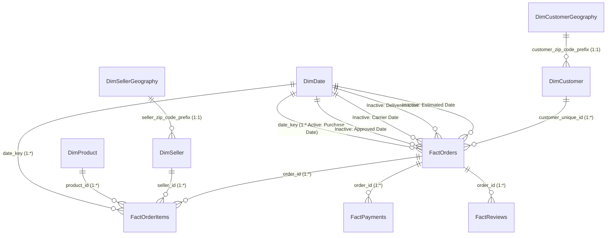

# Enterprise E-Commerce Control Tower — Power BI Architecture & Design Blueprint

**Report Version:** 1.0.0 Enterprise Production  
**Target Platform:** Power BI Desktop / Power BI Service  
**Data Engine:** VertiPaq In-Memory Columnar Storage  
**Data Sources:** Medallion Gold Layer (`data/processed/*.csv` or `ecommerce_control_tower.db`)

---

## 1. Power BI Star Schema Data Model



### Table Relationships Matrix

| From Table | To Table | Relationship Key | Cardinality | Filter Direction | Role / State |
|---|---|---|---|---|---|
| `DimDate` | `FactOrders` | `date_key` | 1 to Many (`1:*`) | Single (`DimDate` $\rightarrow$ `FactOrders`) | **Active** (Purchase Date) |
| `DimDate` | `FactOrders` | `delivery_date_key` | 1 to Many (`1:*`) | Single | Inactive (`USERELATIONSHIP`) |
| `DimDate` | `FactOrders` | `estimated_date_key` | 1 to Many (`1:*`) | Single | Inactive (`USERELATIONSHIP`) |
| `DimCustomer` | `FactOrders` | `customer_unique_id` | 1 to Many (`1:*`) | Single (`DimCustomer` $\rightarrow$ `FactOrders`) | Active |
| `DimProduct` | `FactOrderItems` | `product_id` | 1 to Many (`1:*`) | Single (`DimProduct` $\rightarrow$ `FactOrderItems`) | Active |
| `DimSeller` | `FactOrderItems` | `seller_id` | 1 to Many (`1:*`) | Single (`DimSeller` $\rightarrow$ `FactOrderItems`) | Active |
| `FactOrders` | `FactOrderItems` | `order_id` | 1 to Many (`1:*`) | Single (`FactOrders` $\rightarrow$ `FactOrderItems`) | Active |
| `FactOrders` | `FactPayments` | `order_id` | 1 to Many (`1:*`) | Single (`FactOrders` $\rightarrow$ `FactPayments`) | Active |
| `FactOrders` | `FactReviews` | `order_id` | 1 to Many (`1:*`) | Single (`FactOrders` $\rightarrow$ `FactReviews`) | Active |
| `DimCustomerGeography` | `DimCustomer` | `zip_code_prefix` | 1 to 1 | Single | Conformed Role Dimension |
| `DimSellerGeography` | `DimSeller` | `zip_code_prefix` | 1 to 1 | Single | Conformed Role Dimension |

---

## 2. Power Query (M) Pipeline Architecture

All ETL and data ingestion steps are encapsulated in [`power_bi/power_query_m_code.m`](../power_bi/power_query_m_code.m):
- **Dynamic Parameter `FolderPath`:** Allows instant point-and-click environment switching between local files, team shared drives, or Azure Data Lake Storage.
- **2-Tier Ingestion Design:**
  1. *Staging Layer (`stg_*`):* Ingests raw CSVs, enforces strict data typing, handles empty string replacements, and has **Load Disabled** to conserve memory.
  2. *Production Star Schema (`Fact*`, `Dim*`):* Clean analytical tables referencing staging queries, projected with exact analytical column selections.

---

## 3. Production DAX Measure Hierarchy

All 60+ measures in [`power_bi/dax_measures.dax`](../power_bi/dax_measures.dax) are mapped into standardized display folders:

```
📁 _Measures
  ├── 📁 01_Executive_Revenue (Total Orders, GMV, Freight, AOV, Completion Rate)
  ├── 📁 02_Delivery_Logistics (On-Time Rate %, Delay Days, Handling Days, Transit Days, Severe Delays)
  ├── 📁 03_Customer_Experience (CSAT Average, Promoter Rate %, Detractor Rate %, Net CSAT)
  ├── 📁 04_Time_Intelligence (MoM %, YoY %, YTD, Rolling 3-Month Moving Average)
  ├── 📁 05_Seller_Category (Active Sellers, Pareto Cumulative %, Category Freight Friction)
  ├── 📁 06_Geospatial_Distance (Avg Distance KM, Interstate Share %, Distance Bands)
  └── 📁 07_Retention_Payments (Repeat Customer %, Credit Card Installments, Split Payments)
```

---

## 4. 5-Page Enterprise Dashboard Blueprint

```
┌─────────────────────────────────────────────────────────────────────────────┐
│ 🌟 PAGE 1: EXECUTIVE CONTROL TOWER OVERVIEW                                 │
├─────────────────────────────────────────────────────────────────────────────┤
│ [ KPI Card 1: GMV ] [ KPI Card 2: Orders ] [ KPI Card 3: On-Time % ] [ CSAT] │
│ ─────────────────────────────────────────────────────────────────────────── │
│ 📈 Monthly GMV & Order Volume Trajectory (Dual Axis Line + Column Chart)    │
│ 🗺️ Brazil State Revenue & Order Heatmap (Filled Map / Shape Map)           │
│ 📊 Top 10 Product Categories by GMV (Clustered Bar Chart + Pareto Curve)    │
└─────────────────────────────────────────────────────────────────────────────┘

┌─────────────────────────────────────────────────────────────────────────────┐
│ 🚚 PAGE 2: DELIVERY & OPERATIONAL SLA CONTROL TOWER                         │
├─────────────────────────────────────────────────────────────────────────────┤
│ [ KPI: On-Time 91.9% ] [ KPI: Avg Delivery 12.1d ] [ KPI: Severe Delay 2.3% ]│
│ ─────────────────────────────────────────────────────────────────────────── │
│ 📊 Promised SLA vs Actual Delivery Duration Variance (Histogram / Bell Curve│
│ ⏱️ Lead-Time Breakdown: Seller Handling (2.8d) vs Carrier Transit (9.3d)    │
│ 🏷️ Delivery Delay Bands vs Volume (Early/On-Time, 1-3d, 4-7d, 8d+ Late)     │
│ 📍 State-Level Delivery SLA & Lead-Time Matrix (Table / Matrix with Data Bars│
└─────────────────────────────────────────────────────────────────────────────┘

┌─────────────────────────────────────────────────────────────────────────────┐
│ ⭐ PAGE 3: CUSTOMER EXPERIENCE (CSAT) & REVIEW ANALYTICS                    │
├─────────────────────────────────────────────────────────────────────────────┤
│ [ KPI: Platform CSAT 4.09★ ] [ Promoters 76.8% ] [ Detractors 15.2% ]       │
│ ─────────────────────────────────────────────────────────────────────────── │
│ 📉 The CSAT Delay Degradation Curve (Line Chart: Delay Days vs Star Rating) │
│ 📊 Review Score Distribution (1 to 5 Stars Donut / Bar Chart)               │
│ 🎯 Detractor Root Cause Pareto (Late Delivery vs Product Description Defect)│
│ 🚨 VIP Detractor Orders Table (High GMV Orders with 1-Star Review)          │
└─────────────────────────────────────────────────────────────────────────────┘

┌─────────────────────────────────────────────────────────────────────────────┐
│ 🏪 PAGE 4: SELLER STRATEGIC 4-QUADRANT MATRIX & SCORECARDS                  │
├─────────────────────────────────────────────────────────────────────────────┤
│ [ Active Sellers: 3,095 ] [ Top 10% GMV Share: 68.4% ] [ High-Risk Sellers] │
│ ─────────────────────────────────────────────────────────────────────────── │
│ 🎯 Seller 4-Quadrant Scatter Plot (X: Total GMV Log, Y: Average CSAT)        │
│    • Q1 Stars (High GMV / High CSAT)       • Q2 Operational Risk (VIP Alert)│
│    • Q3 Niche Champions (Growth)           • Q4 Underperformers (Probation) │
│ 📋 Master Seller Scorecard (Matrix: Rank, GMV, Orders, On-Time %, CSAT)     │
└─────────────────────────────────────────────────────────────────────────────┘

┌─────────────────────────────────────────────────────────────────────────────┐
│ 🗺️ PAGE 5: GEOSPATIAL & FREIGHT LOGISTICS INTELLIGENCE                      │
├─────────────────────────────────────────────────────────────────────────────┤
│ [ Avg Distance: 597 KM ] [ Interstate Share: 64.2% ] [ Avg Freight: R$20.0] │
│ ─────────────────────────────────────────────────────────────────────────── │
│ 🌐 Haversine Distance Band Performance (0-100km, 101-500km, ..., 2000km+)   │
│ 💰 Freight-to-Price Friction Ratio by Product Category                      │
│ 🔄 Origin-Destination State Logistics Flow (Matrix / Sankey Diagram)        │
└─────────────────────────────────────────────────────────────────────────────┘
```
